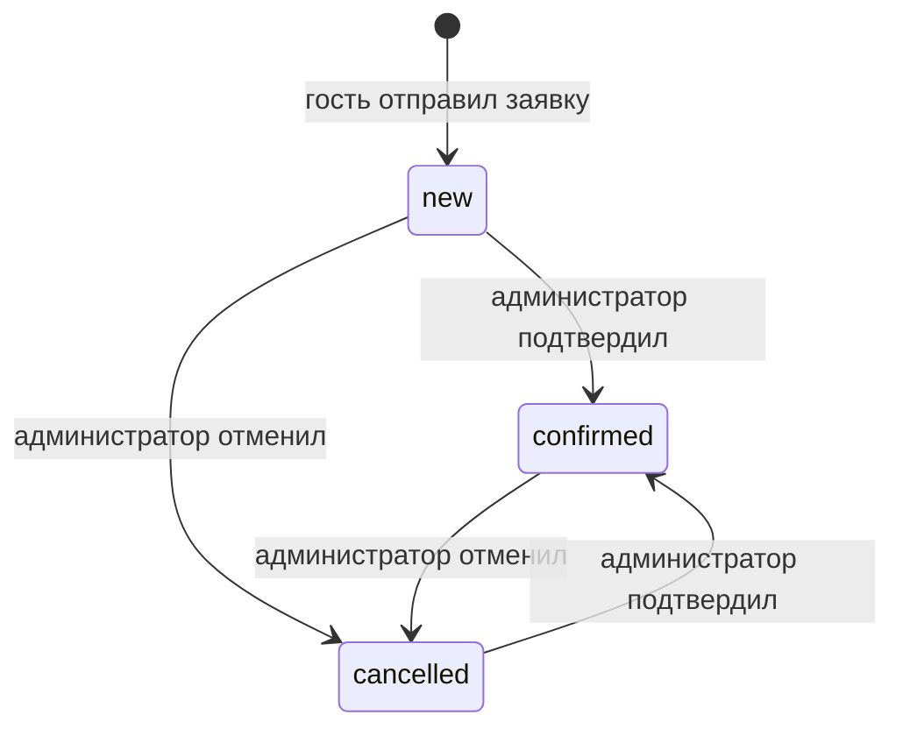
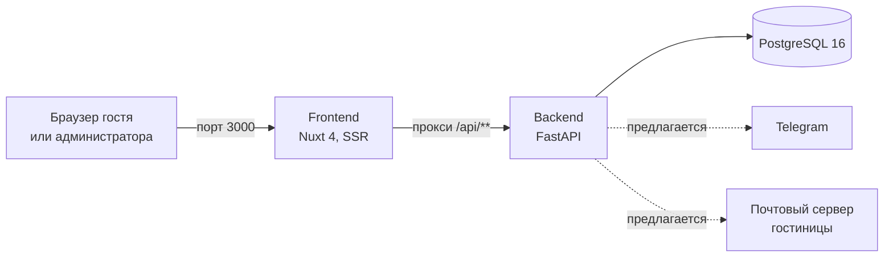
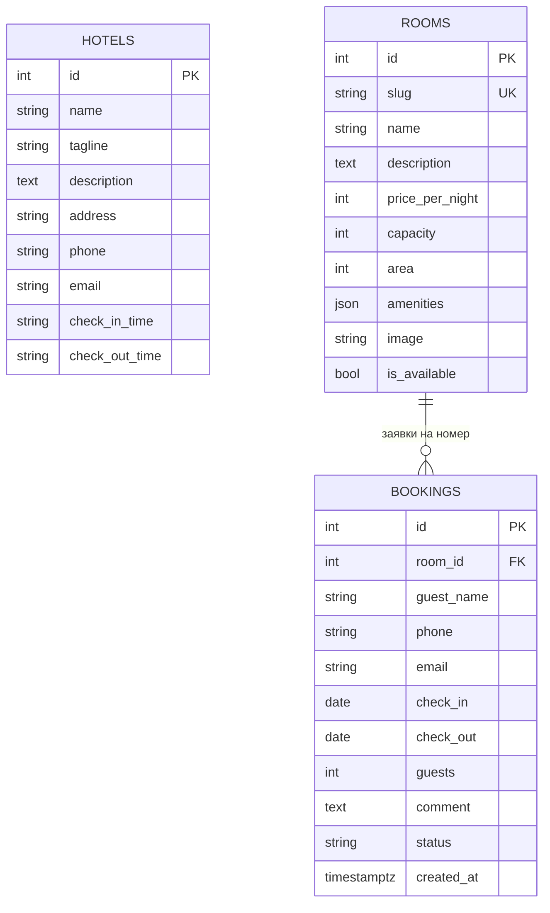

# Спецификация проекта Kivana

**Документ на утверждение.** Версия 1.0 от 21 сентября 2026.

Документ описывает, что делает система, как она устроена и какие решения по ней нужно утвердить. У каждого требования есть статус:

- **Реализовано** — работает в текущей версии; как это проверено, описано в разделе 11.
- **Предлагается** — спроектировано, но не реализовано; реализация начнётся после утверждения.

Технические подробности для разработчиков вынесены в остальные файлы каталога `docs/`, здесь на них даются ссылки.

## Содержание

1. [Назначение и границы](#1-назначение-и-границы)
2. [Роли](#2-роли)
3. [Функциональные требования](#3-функциональные-требования)
4. [Бизнес-правила](#4-бизнес-правила)
5. [Нефункциональные требования](#5-нефункциональные-требования)
6. [Архитектура](#6-архитектура)
7. [Модель данных](#7-модель-данных)
8. [API](#8-api)
9. [Безопасность](#9-безопасность)
10. [Развёртывание и настройка](#10-развёртывание-и-настройка)
11. [Контроль качества](#11-контроль-качества)
12. [Предлагается: уведомления](#12-предлагается-уведомления)
13. [Вне рамок проекта](#13-вне-рамок-проекта)
14. [Решения на утверждение](#14-решения-на-утверждение)
15. [Критерии приёмки](#15-критерии-приёмки)

## 1. Назначение и границы

**Цель.** Сайт небольшой городской гостиницы, через который гость выбирает номер и оставляет заявку на бронирование, а администратор обрабатывает заявки.

**Модель работы.** Заявка — не бронь. Гость отправляет заявку, администратор связывается с ним, после чего подтверждает или отменяет заявку в админке. Только подтверждённая заявка закрывает даты номера.

**Что входит:**

- публичный сайт: главная, каталог номеров с фильтрами, карточка номера с формой заявки, контакты;
- админка для обработки заявок;
- JSON API, через которое работают обе части;
- запуск всей системы одной командой в Docker.

**Что не входит** перечислено в разделе 13.

**Содержимое сайта.** Название, адрес, телефон, описания и цены номеров в текущей версии демонстрационные. Перед запуском их нужно заменить реальными данными гостиницы, см. решение Р-1 в разделе 14.

## 2. Роли

| Роль | Кто это | Что может | Как входит |
|---|---|---|---|
| Гость | Любой посетитель сайта | Смотреть номера, фильтровать, отправлять заявки | Без входа |
| Администратор | Сотрудник гостиницы | Всё, что гость, а также видеть заявки и менять их статус | Логин и пароль на `/admin/login` |

Администратор в системе один: логин и пароль задаются настройками сервера. Учётных записей для нескольких сотрудников нет, см. решение Р-4.

## 3. Функциональные требования

### Публичная часть

| ID | Требование | Статус |
|---|---|---|
| ФТ-1 | Главная страница показывает название и слоган гостиницы, описание, три номера, перечень услуг и контакты | Реализовано |
| ФТ-2 | Каталог показывает все номера, упорядоченные по цене | Реализовано |
| ФТ-3 | Каталог фильтруется по минимальной вместимости (от 1 до 5 гостей) и максимальной цене (3 000, 5 000, 7 000, 10 000, 15 000 ₽). Фильтрация выполняется на сервере | Реализовано |
| ФТ-4 | Если под фильтр ничего не подошло, показывается сообщение и кнопка сброса фильтров | Реализовано |
| ФТ-5 | Карточка номера показывает изображение, описание, цену за ночь, вместимость, площадь и список удобств | Реализовано |
| ФТ-6 | В карточке доступного номера есть форма заявки: имя, телефон, почта, даты заезда и выезда, число гостей, комментарий | Реализовано |
| ФТ-7 | Форма проверяет данные до отправки и показывает ошибку под каждым неверным полем | Реализовано |
| ФТ-8 | После успешной отправки форма заменяется подтверждением «Заявка принята» | Реализовано |
| ФТ-9 | Если сервер отклонил заявку, форма показывает причину по-русски | Реализовано |
| ФТ-10 | Для номера, снятого с продажи, вместо формы показывается сообщение и ссылка на другие номера | Реализовано |
| ФТ-11 | Страница контактов показывает адрес, телефон, почту, время заезда и выезда, как добраться | Реализовано |
| ФТ-12 | Несуществующая страница показывает «Такой страницы нет» с кодом 404 | Реализовано |
| ФТ-13 | Если сервер данных недоступен, страницы показывают сообщение об ошибке загрузки, а не пустой результат | Реализовано |

### Админка

| ID | Требование | Статус |
|---|---|---|
| ФТ-20 | Вход по логину и паролю. Без входа админка недоступна, открытие `/admin` перенаправляет на страницу входа | Реализовано |
| ФТ-21 | Список заявок, сначала новые: дата создания, номер, имя, телефон, почта, даты, число ночей, число гостей, комментарий, статус | Реализовано |
| ФТ-22 | Фильтр списка по статусу: все, новые, подтверждённые, отменённые | Реализовано |
| ФТ-23 | Постраничный вывод по 20 заявок | Реализовано |
| ФТ-24 | Кнопки «Подтвердить» и «Отменить» у каждой заявки | Реализовано |
| ФТ-25 | При попытке подтвердить заявку на уже занятые даты показывается причина отказа | Реализовано |
| ФТ-26 | Выход из админки | Реализовано |
| ФТ-27 | Сессия администратора действует 12 часов | Реализовано |

### Уведомления

| ID | Требование | Статус |
|---|---|---|
| ФТ-30 | Сообщение администратору в Telegram о каждой новой заявке | Предлагается, раздел 12 |
| ФТ-31 | Письмо гостю при подтверждении или отмене заявки | Предлагается, раздел 12 |

## 4. Бизнес-правила

### Статусы заявки



| Статус | Значение | Закрывает даты |
|---|---|---|
| `new`, новая | Заявка получена, администратор ещё не связался с гостем | Нет |
| `confirmed`, подтверждена | Администратор договорился с гостем | Да |
| `cancelled`, отменена | Гость отказался или номер не подошёл | Нет |

Интерфейс админки позволяет только подтвердить и отменить. API дополнительно позволяет вернуть заявку в статус «новая», в интерфейсе такой кнопки нет.

### Правила заявки

| ID | Правило | Ответ при нарушении |
|---|---|---|
| БП-1 | Номер существует | 404 «Номер не найден» |
| БП-2 | Номер не снят с продажи | 400 «Этот номер сейчас недоступен для брони» |
| БП-3 | Гостей не больше вместимости номера | 400 «Максимальное число гостей в номере — N» |
| БП-4 | Дата заезда не раньше сегодняшнего дня | 422 «Дата заезда не может быть в прошлом» |
| БП-5 | Дата выезда позже даты заезда | 422 «Дата выезда должна быть позже даты заезда» |
| БП-6 | Даты не пересекаются с подтверждённой заявкой на тот же номер | 409 «Номер уже занят на выбранные даты. Выберите другие даты или другой номер» |
| БП-7 | Подтвердить можно только заявку, чьи даты не пересекаются с другой подтверждённой | 409 «На эти даты в номере уже есть подтверждённая заявка» |
| БП-8 | Выезд одного гостя и заезд другого в тот же день не считаются пересечением | — |

**Почему новые заявки не закрывают даты.** Иначе любой посетитель мог бы занять весь календарь фальшивыми заявками. Даты закрывает только решение администратора.

**Гарантия правила БП-7.** Его соблюдает сама база данных, а не только код. Даже если два администратора одновременно подтвердят пересекающиеся заявки, пройдёт только одно подтверждение.

### Правила полей формы

| Поле | Правило |
|---|---|
| Имя | от 2 до 120 символов, пробелы по краям обрезаются |
| Телефон | от 10 до 15 цифр, скобки, пробелы и дефисы допускаются |
| Почта | формат `имя@домен.зона`, до 120 символов |
| Гостей | от 1 до 20 и не больше вместимости номера |
| Комментарий | необязателен, до 1000 символов |

Правила проверяются дважды: в браузере для быстрого ответа и на сервере для гарантии. Обойти их, отправив запрос мимо формы, нельзя.

## 5. Нефункциональные требования

| ID | Требование | Статус |
|---|---|---|
| НФТ-1 | Страницы формируются на сервере: содержимое видно без JavaScript и индексируется поисковиками | Реализовано |
| НФТ-2 | Вёрстка адаптивна для телефона и компьютера | Реализовано |
| НФТ-3 | Все тексты интерфейса и сообщения об ошибках на русском | Реализовано |
| НФТ-4 | Сайт работает без внешних CDN, шрифтов и сервисов | Реализовано |
| НФТ-5 | Система запускается одной командой `docker compose up --build` без ручных шагов | Реализовано |
| НФТ-6 | Повторный запуск не дублирует данные и не теряет заявки | Реализовано |
| НФТ-7 | Схема базы меняется миграциями без потери данных | Реализовано |
| НФТ-8 | Частота заявок и попыток входа ограничена, см. раздел 9 | Реализовано |
| НФТ-9 | Служебные страницы админки закрыты от индексации | Реализовано |
| НФТ-10 | Резервное копирование базы | Не реализовано, решение Р-6 |
| НФТ-11 | Работа по HTTPS | Не реализовано, решение Р-5 |

## 6. Архитектура

### Компоненты



| Компонент | Технология | Ответственность |
|---|---|---|
| Frontend | Nuxt 4, Vue 3, TypeScript | Формирует страницы на сервере, проксирует запросы к API |
| Backend | Python 3.12, FastAPI, SQLAlchemy 2.0, Pydantic v2, Alembic | Бизнес-правила, проверки, доступ к базе, вход администратора |
| База данных | PostgreSQL 16 | Хранение данных, гарантия непересечения подтверждённых заявок |
| Оркестрация | Docker Compose | Запуск трёх сервисов, порядок старта, сеть между ними |

### Ключевые решения

| Решение | Почему | Цена |
|---|---|---|
| Браузер ходит в API через прокси frontend, а не напрямую | Один адрес для браузера: не нужен CORS, cookie админки работает без дополнительной настройки, порт API можно закрыть от сети | Лишний сетевой переход на каждый запрос |
| Непересечение подтверждённых заявок обеспечивает ограничение базы | Проверка в коде пропускает одновременные подтверждения, ограничение базы — нет | Правило живёт в миграции, а не в коде модели |
| Вход администратора через подписанную cookie с httpOnly | Токен недоступен из JavaScript, не нужна таблица сессий | Один администратор, пароль в настройках сервера |
| Миграции Alembic | Схема меняется без потери заявок | Изменения схемы требуют файла миграции |
| Лимиты частоты в памяти процесса | Не нужен отдельный сервис вроде Redis | Лимиты сбрасываются при перезапуске и не работают при нескольких процессах backend |
| Сервисы работают в режиме разработки | Решение владельца проекта на текущем этапе | Нет продакшен-сборки, см. раздел 10 |

### Порядок запуска

1. PostgreSQL стартует и проходит проверку готовности.
2. Backend применяет миграции базы.
3. Backend наполняет пустую базу данными гостиницы и номеров. Если данные уже есть, шаг пропускается.
4. Backend начинает принимать запросы.
5. Frontend стартует и начинает отдавать страницы.

Подробнее: [02-architecture.md](02-architecture.md), [03-runtime-flows.md](03-runtime-flows.md).

## 7. Модель данных



| Сущность | Что хранит | Кто меняет |
|---|---|---|
| Гостиница | Одна запись: название, описание, контакты, время заезда и выезда | Разработчик через начальные данные или миграцию |
| Номер | Шесть категорий: цена за ночь в рублях, вместимость, площадь, удобства, изображение, признак продажи | Разработчик через начальные данные или миграцию |
| Заявка | Данные гостя, даты, число гостей, комментарий, статус, время создания | Гость создаёт, администратор меняет статус |

Ограничения на уровне базы:

- дата выезда позже даты заезда;
- гостей не меньше одного;
- статус только из трёх допустимых значений;
- две подтверждённые заявки на один номер не пересекаются по датам.

Подробнее: [05-data-model.md](05-data-model.md).

## 8. API

Все маршруты начинаются с `/api`. Интерактивное описание со схемами доступно в Swagger на `http://localhost:8000/docs` с машины, где запущена система.

### Публичные

| Метод | Маршрут | Назначение | Коды ответа |
|---|---|---|---|
| GET | `/api/health` | Проверка работоспособности | 200 |
| GET | `/api/hotel` | Данные гостиницы | 200, 404 |
| GET | `/api/rooms` | Список номеров; параметры `capacity`, `max_price` | 200, 422 |
| GET | `/api/rooms/{slug}` | Один номер | 200, 404 |
| POST | `/api/bookings` | Создание заявки | 201, 400, 404, 409, 422, 429 |

### Админка

Все маршруты, кроме входа и выхода, требуют сессии администратора и без неё отвечают 401.

| Метод | Маршрут | Назначение | Коды ответа |
|---|---|---|---|
| POST | `/api/admin/login` | Вход, устанавливает cookie сессии | 204, 401, 422, 429, 503 |
| POST | `/api/admin/logout` | Выход | 204 |
| GET | `/api/admin/me` | Проверка сессии | 200, 401 |
| GET | `/api/admin/bookings` | Список заявок; параметры `status`, `limit` (до 100), `offset` | 200, 401, 422 |
| PATCH | `/api/admin/bookings/{id}` | Смена статуса заявки | 200, 401, 404, 409, 422 |

### Пример заявки

```json
{
  "room_id": 2,
  "guest_name": "Иван Петров",
  "phone": "+7 900 123-45-67",
  "email": "ivan@example.com",
  "check_in": "2026-10-10",
  "check_out": "2026-10-13",
  "guests": 2,
  "comment": "Ранний заезд"
}
```

Ответ 201 содержит ту же заявку с присвоенным `id`, статусом `new` и временем создания.

Подробнее: [04-backend.md](04-backend.md).

## 9. Безопасность

| Мера | Как устроена | Статус |
|---|---|---|
| Вход администратора | Логин и пароль из настроек сервера, сравнение без утечки по времени ответа | Реализовано |
| Вход отключён без пароля | Если пароль не задан, вход невозможен вообще, в том числе с пустым паролем | Реализовано |
| Сессия | Cookie с подписью HMAC-SHA256, недоступна из JavaScript, не отправляется с чужих сайтов, живёт 12 часов | Реализовано |
| Защита от подделки запросов с чужих сайтов | Обеспечивается режимом cookie `SameSite=Lax` | Реализовано |
| Лимит заявок | 5 за 10 минут с одного IP и 30 за 10 минут на весь сайт | Реализовано |
| Лимит попыток входа | 10 за 10 минут с одного IP и 30 за 10 минут на весь сайт | Реализовано |
| Закрытые порты | База и API доступны только с машины, где запущена система; из сети открыт только сайт | Реализовано |
| Проверка входных данных | Все данные проверяются на сервере независимо от браузера | Реализовано |
| HTTPS | Не настроен | Решение Р-5 |

**Известное ограничение.** Пока frontend работает в режиме разработки, лимит по IP можно обойти, подделав заголовок с адресом клиента. Поток спама всё равно упирается в общий лимит на сайт. Обратная сторона общего лимита: атакующий может исчерпать его и на 10 минут закрыть форму для настоящих гостей. Ограничение снимается переходом на продакшен-сборку, см. решение Р-5.

Подробнее: [09-tech-debt.md](09-tech-debt.md).

## 10. Развёртывание и настройка

### Сервисы

| Сервис | Порт | Доступ |
|---|---|---|
| Сайт | 3000 | Из сети |
| API и Swagger | 8000 | Только с этой машины |
| База данных | 5432 | Только с этой машины |

### Настройки

Все настройки необязательны и задаются в файле `.env`. Шаблон с комментариями — `.env.example`.

| Настройка | По умолчанию | Назначение |
|---|---|---|
| `POSTGRES_USER`, `POSTGRES_PASSWORD`, `POSTGRES_DB` | `hotel` | Доступ к базе |
| `ADMIN_USERNAME` | `admin` | Логин администратора |
| `ADMIN_PASSWORD` | пусто | Пароль администратора; пока пуст, админка закрыта |
| `SECRET_KEY` | случайный при старте | Ключ подписи сессии; без него администратора разлогинивает при перезапуске |
| `COOKIE_SECURE` | `false` | Включить, когда появится HTTPS |
| `WATCH_POLLING` | `true` | Режим отслеживания файлов при разработке на Windows |

### Запуск

```bash
docker compose up --build
```

**Текущий режим.** Сервисы работают в режиме разработки: исходный код подключён к контейнерам, изменения применяются без пересборки. Продакшен-сборки, HTTPS, автоперезапуска после сбоя и резервного копирования нет. Это решение текущего этапа, см. решения Р-5 и Р-6.

Подробнее: [07-infrastructure.md](07-infrastructure.md).

## 11. Контроль качества

| Проверка | Что покрывает | Результат |
|---|---|---|
| Автотесты backend, 28 шт. | Каталог и фильтры, все ветки создания заявки, пересечение дат при создании и подтверждении, вход, выход, подпись и срок сессии, отключённый вход, список и фильтр заявок, оба вида лимитов | Проходят |
| Изолированная тестовая база | Тесты создают отдельную базу, применяют к ней миграции и удаляют её; рабочие данные не затрагиваются | Работает |
| Сверка моделей с миграциями | `alembic check` | Расхождений нет |
| Проверка типов frontend | `vue-tsc` | Ошибок нет; выполнена вручную, в автоматический процесс не встроена |
| Сквозная проверка | Чистый запуск, все страницы, заявка, вход в админку, подтверждение, отказ при пересечении, лимит | Выполнена |

Автотестов для интерфейса нет. Интерфейс админки нужно проверить вручную при приёмке, см. раздел 15.

## 12. Предлагается: уведомления

Сейчас о новой заявке никто не узнаёт автоматически: администратор видит её, только открыв админку, а гость не получает писем.

### Что предлагается

| Кому | Канал | Когда | Содержание |
|---|---|---|---|
| Администратору | Telegram | Сразу после создания заявки | Номер, даты, число ночей, гость, телефон, комментарий, ссылка в админку |
| Гостю | Электронная почта | Когда администратор подтвердил заявку | Номер, даты, время заезда и выезда, адрес и телефон гостиницы |
| Гостю | Электронная почта | Когда администратор отменил заявку | Номер, даты, телефон гостиницы для связи |

### Почему именно так

- **Администратору Telegram.** Сообщение приходит на телефон за секунды, бот бесплатный. Письмо о заявке легко пропустить или найти в спаме.
- **Гостю письмо только после решения администратора.** Если отправлять письмо сразу при создании заявки, форма станет инструментом рассылки: кто угодно впишет чужой адрес, и гостиница начнёт слать письма незнакомым людям. Письмо по действию администратора этой проблемы не создаёт. О приёме заявки гость узнаёт на экране сразу после отправки.

### Как устроено

- Отправка идёт после сохранения заявки и не задерживает ответ. Сбой Telegram или почты не мешает созданию заявки и смене статуса: ошибка пишется в журнал, заявка остаётся в админке.
- У сетевых запросов ограничено время ожидания, около 5 секунд.
- Каналы включаются настройками. Пока настройки пусты, канал выключен, и система работает как сейчас.
- Данные гостя передаются простым текстом, без разметки, и не попадают в заголовки письма.
- Новых библиотек не нужно: отправка в Telegram и почта работают средствами стандартной библиотеки Python.

### Новые настройки

| Настройка | Назначение |
|---|---|
| `TELEGRAM_BOT_TOKEN` | Токен бота от @BotFather |
| `TELEGRAM_CHAT_ID` | Чат или группа, куда приходят заявки |
| `SMTP_HOST`, `SMTP_PORT` | Почтовый сервер гостиницы |
| `SMTP_USER`, `SMTP_PASSWORD` | Учётная запись для отправки |
| `MAIL_FROM` | Адрес отправителя, например `booking@домен-гостиницы.ru` |
| `SITE_URL` | Адрес сайта для ссылок в сообщениях |

### Ограничение

Если backend перезапустится в момент между сохранением заявки и отправкой уведомления, уведомление потеряется без повторной попытки. Заявка при этом сохранится и будет видна в админке. Надёжная доставка с повторами требует отдельной очереди и заметно больше работы; предлагается вернуться к ней, только если потери станут заметны.

### Что нужно от гостиницы

- Создать бота через @BotFather и чат для заявок.
- Предоставить доступ к почте на домене гостиницы, например через Яндекс 360.
- Настроить у домена записи SPF и DKIM в панели почтового провайдера, иначе письма гостям будут попадать в спам.

### Как будет проверено

- Автотесты: сообщение администратору уходит при создании заявки, письмо гостю — при подтверждении и отмене, при пустых настройках ничего не отправляется, сбой отправки не ломает заявку. Сеть в тестах подменяется заглушкой.
- Вручную: для проверки писем без реальной отправки в среду разработки добавляется почтовый перехватчик Mailpit.

## 13. Вне рамок проекта

В текущий объём не входит:

- онлайн-оплата и предоплата;
- личный кабинет гостя и отслеживание статуса заявки на сайте;
- редактирование номеров, цен и текстов через админку;
- несколько учётных записей сотрудников и журнал действий;
- календарь занятости номеров на сайте;
- интеграция с системами бронирования и агрегаторами;
- многоязычность;
- продакшен-сборка, HTTPS и резервное копирование, до отдельного решения.

## 14. Решения на утверждение

| ID | Вопрос | Предложение |
|---|---|---|
| Р-1 | Содержимое сайта | Предоставить реальные название, адрес, телефон, почту, описания, цены, удобства и фотографии номеров. Демонстрационные данные будут заменены |
| Р-2 | Уведомления | Утвердить схему раздела 12: Telegram администратору, письма гостю только о подтверждении и отмене |
| Р-3 | Лимиты | Утвердить значения: 5 заявок с одного адреса и 30 на весь сайт за 10 минут |
| Р-4 | Число администраторов | Оставить одну учётную запись. Если сотрудников несколько и нужно знать, кто подтвердил заявку, — отдельная задача |
| Р-5 | Продакшен и HTTPS | Определить сроки перевода на продакшен-сборку с HTTPS. До этого сайт работает в режиме разработки с ограничениями раздела 9 |
| Р-6 | Резервные копии | Ежедневная выгрузка базы по расписанию на сервере с хранением 14 дней |
| Р-7 | Длина проживания | Ввести ограничения: не больше 90 ночей и заезд не позже чем через год. Сейчас ограничений нет. Порог выбран по практике агрегаторов (Booking.com, Airbnb): у них базовый максимум — 28–30 ночей, но с отдельной опцией для длительных заездов расширяется до 90 — это покрывает и обычные брони, и командировки/переезды на месяц-два, отсекая только аномальные значения |
| Р-8 | Лицензия | Определить условия использования кода. Для сайта конкретной гостиницы обычно выбирают проприетарную лицензию |

## 15. Критерии приёмки

Система принимается, если на чистом запуске выполняются все пункты:

1. Команда `docker compose up --build` поднимает систему без ручных шагов, сайт открывается на `http://localhost:3000`.
2. Главная, каталог, карточка номера и контакты открываются и показывают данные гостиницы.
3. Фильтры каталога сужают выдачу; при отсутствии подходящих номеров показывается сообщение и кнопка сброса.
4. Заявка с корректными данными принимается, форма показывает подтверждение, заявка появляется в админке со статусом «Новая».
5. Заявка с ошибками не отправляется, под полями видны причины.
6. Без пароля администратора вход в админку невозможен; с паролем из `.env` вход работает.
7. Администратор подтверждает заявку; новая заявка на пересекающиеся даты этого номера отклоняется с понятным сообщением.
8. Подтверждение второй заявки на те же даты отклоняется с понятным сообщением.
9. Выезд одного гостя и заезд другого в тот же день не считаются пересечением.
10. Шестая заявка с одного адреса за 10 минут отклоняется сообщением о превышении лимита.
11. Повторный запуск системы не дублирует данные и не теряет заявки.
12. Автотесты проходят: `docker compose exec backend pytest`.
13. Страницы корректно выглядят на телефоне и на компьютере.

После утверждения раздела 12 к критериям добавляются:

14. Администратор получает сообщение в Telegram о новой заявке.
15. Гость получает письмо при подтверждении и при отмене заявки.
16. При недоступном Telegram или почтовом сервере заявка создаётся и статус меняется без ошибок.