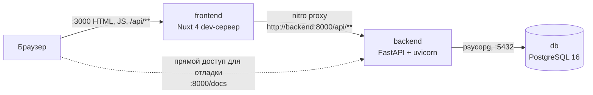
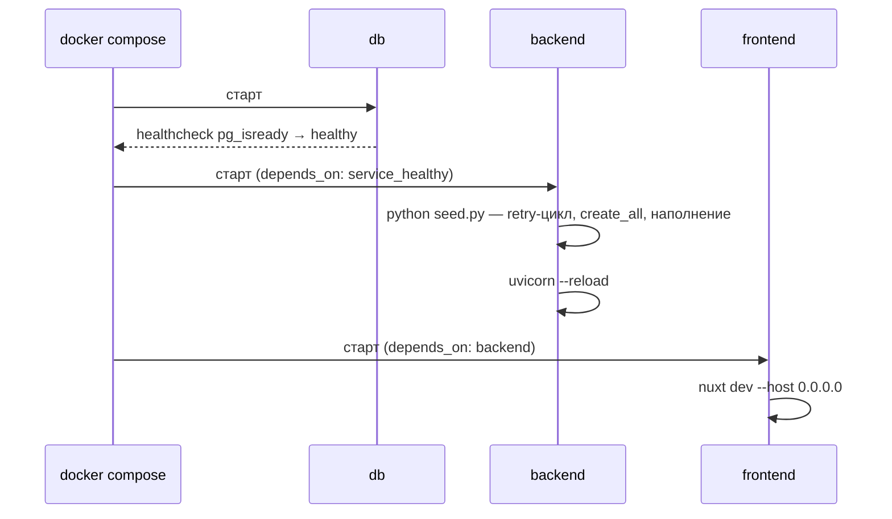

# 02. Архитектура

## Три контейнера



Все три сервиса описаны в [docker-compose.yml](../docker-compose.yml). Наружу открыты порты 3000, 8000 и 5432; порт 8000 нужен не сайту, а разработчику — для Swagger и curl.

## Ключевое решение: прокси вместо CORS

В [nuxt.config.ts](../frontend/nuxt.config.ts) объявлено правило:

```ts
routeRules: {
  '/api/**': { proxy: `${apiBase}/api/**` },
}
```

Из этого следует цепочка:

1. Компоненты запрашивают относительный путь — `useFetch('/api/rooms')`, никаких абсолютных адресов в коде фронта нет.
2. При SSR запрос выполняет сам nitro и проксирует его на `http://backend:8000` по внутренней сети Compose.
3. В браузере запрос уходит на `http://localhost:3000/api/rooms`, то есть на тот же origin, и nitro снова проксирует его на backend.

Поскольку браузер никогда не обращается к чужому origin, preflight-запросов не возникает и **CORS-middleware в FastAPI не нужен**. Его отсутствие — не упущение, а следствие этой схемы; добавление `CORSMiddleware` было бы мёртвым кодом.

Адрес backend берётся из переменной `API_BASE` с дефолтом `http://localhost:8000`, поэтому тот же конфиг работает и вне Docker, когда uvicorn запущен на хосте.

**Trade-off.** Каждый запрос браузера идёт через лишний прыжок — Node проксирует его на Python. В продакшене эту роль обычно берёт на себя reverse proxy перед обоими сервисами. Взамен код фронта не знает про адреса и не требует ни одной переменной окружения в браузерном бандле.

## Границы модулей

| Компонент | Знает про | Не знает про |
|---|---|---|
| `frontend/app/pages` | относительные пути `/api/**`, типы из `types.ts` | базу, порты, имена контейнеров |
| `frontend/nuxt.config.ts` | `API_BASE` | структуру API |
| `backend/app/routers` | модели и схемы | HTTP-клиента, фронт |
| `backend/app/models.py` | таблицы | HTTP |
| `backend/seed.py` | модели и engine | приложение FastAPI |

Направление зависимостей одностороннее: `routers → schemas/models → database`. Обратных импортов нет, циклов нет.

## Порядок запуска



Команда backend в [docker-compose.yml](../docker-compose.yml) — это `sh -c "python seed.py && uvicorn ..."`. Отдельного entrypoint-скрипта нет: `&&` даёт нужный порядок, а если сид упадёт, uvicorn не стартует и это видно сразу.

Ожидание базы продублировано на двух уровнях: healthcheck в Compose и retry-цикл `wait_for_db` в [seed.py](../backend/seed.py). Второй нужен потому, что `pg_isready` может ответить утвердительно за мгновение до того, как база завершит первичную инициализацию.

## Вопросы на понимание

1. Почему `useFetch('/api/rooms')` работает и на сервере, и в браузере, хотя backend слушает другой порт?
2. Что сломается, если убрать `API_BASE` из compose и оставить только дефолт?
3. Зачем ожидание базы реализовано дважды?
