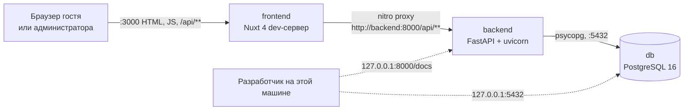
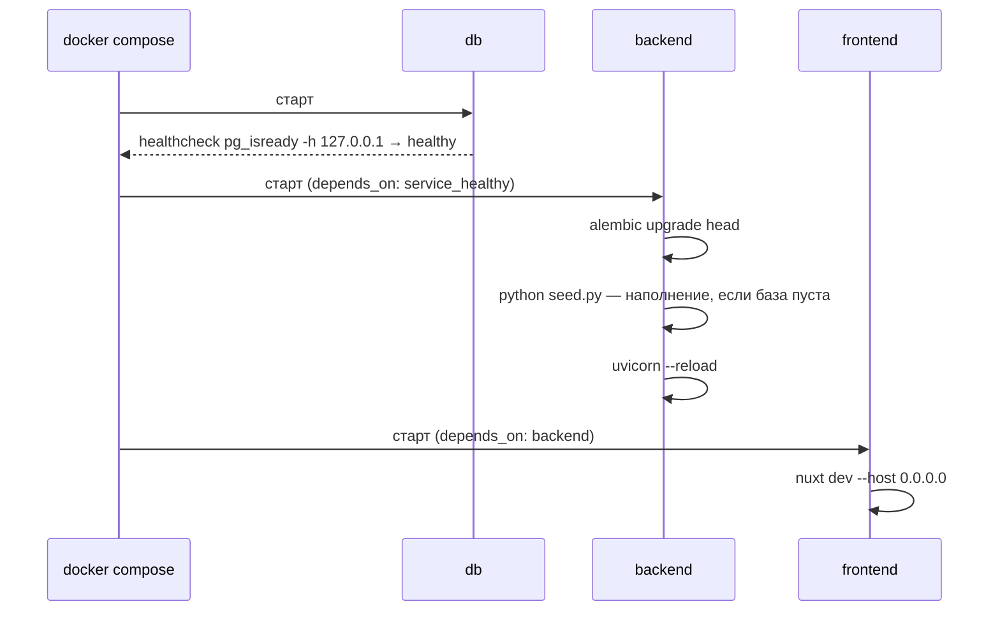

# 02. Архитектура

## Три контейнера



Все три сервиса описаны в [docker-compose.yml](../docker-compose.yml). Наружу на все интерфейсы открыт только порт 3000. Порты 8000 и 5432 привязаны к `127.0.0.1`: Swagger и psql доступны разработчику на этой машине, но не из сети.

## Ключевое решение: прокси вместо CORS

В [nuxt.config.ts](../frontend/nuxt.config.ts) объявлено правило:

```ts
routeRules: {
  '/api/**': { proxy: `${apiBase}/api/**` },
}
```

Из этого следует цепочка:

1. Код фронта запрашивает относительный путь — `useFetch('/api/rooms')`, `$fetch('/api/admin/login')`. Абсолютных адресов в нём нет.
2. При SSR запрос выполняет сам nitro и проксирует его на `http://backend:8000` по внутренней сети Compose.
3. В браузере запрос уходит на `http://localhost:3000/api/...`, то есть на тот же origin, и nitro снова проксирует его на backend.

Поскольку браузер никогда не обращается к чужому origin, preflight-запросов нет и **CORS-middleware в FastAPI не нужен**. Админка устроена так же: она ходит на тот же `/api/**`, поэтому и ей CORS не нужен.

Прокси пересылает заголовки в обе стороны, и на этом держится вход администратора. Ответ `/api/admin/login` приносит `Set-Cookie`, браузер сохраняет cookie для origin `localhost:3000` и отправляет её со следующими запросами. При SSR страницы `/admin` Nuxt пересылает cookie входящего запроса во внутренний `useFetch`, поэтому серверный рендер тоже видит сессию.

Адрес backend берётся из переменной `API_BASE` с дефолтом `http://localhost:8000`, поэтому тот же конфиг работает и вне Docker.

**Trade-off.** Каждый запрос браузера проходит лишний прыжок через Node. Взамен код фронта не знает адресов, не держит переменных окружения в бандле и не требует CORS.

## IP клиента и его ограничения

Dev-сервер Nuxt ставит заголовок `X-Forwarded-For` с адресом клиента, а прокси `routeRules` пересылает его в backend. Uvicorn доверяет этому заголовку, потому что в compose задано `FORWARDED_ALLOW_IPS: "*"`. Отсюда берётся IP для ограничения частоты в [security.py](../backend/app/security.py).

У этой схемы есть предел. Если клиент прислал `X-Forwarded-For` сам, dev-сервер Nuxt его не перезаписывает, и лимит по IP обходится подделкой заголовка. Поэтому рядом с лимитом по IP стоит общий потолок на весь сайт, который от IP не зависит. Подробности — в [04-backend.md](04-backend.md), последствия — в [09-tech-debt.md](09-tech-debt.md).

## Границы модулей

| Компонент | Знает про | Не знает про |
|---|---|---|
| `frontend/app/pages` | относительные пути `/api/**`, типы из `types.ts` | базу, порты, имена контейнеров |
| `frontend/nuxt.config.ts` | `API_BASE`, `WATCH_POLLING` | структуру API |
| `backend/app/routers` | модели, схемы, зависимости из `security.py` | HTTP-клиента, фронт |
| `backend/app/security.py` | переменные окружения администратора, `Request` | базу |
| `backend/app/models.py` | таблицы | HTTP |
| `backend/migrations` | модели и `DATABASE_URL` | приложение FastAPI |
| `backend/seed.py` | модели и сессию | приложение FastAPI |

Направление зависимостей одностороннее: `routers → schemas/models/security → database`. Обратных импортов и циклов нет.

## Порядок запуска



Команда backend в [docker-compose.yml](../docker-compose.yml): `sh -c "alembic upgrade head && python seed.py && uvicorn ..."`. Отдельного entrypoint-скрипта нет: `&&` даёт нужный порядок, а если миграция или сид упадут, uvicorn не стартует и причина видна в логах.

Отдельного цикла ожидания базы нет, его заменяет правильный healthcheck. `pg_isready` проверяет базу по TCP через `-h 127.0.0.1`. Через unix-сокет он отвечал бы «готово» ещё во время первичной инициализации тома, когда временный сервер TCP не слушает и база `hotel` может быть не создана.

## Вопросы на понимание

1. Почему админке тоже не нужен CORS, хотя она работает с cookie?
2. Почему рядом с лимитом по IP нужен общий потолок на весь сайт?
3. Что изменилось бы, если бы healthcheck вызывал `pg_isready` без `-h`?
