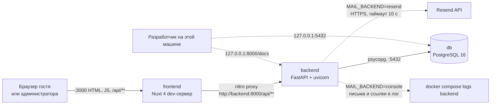
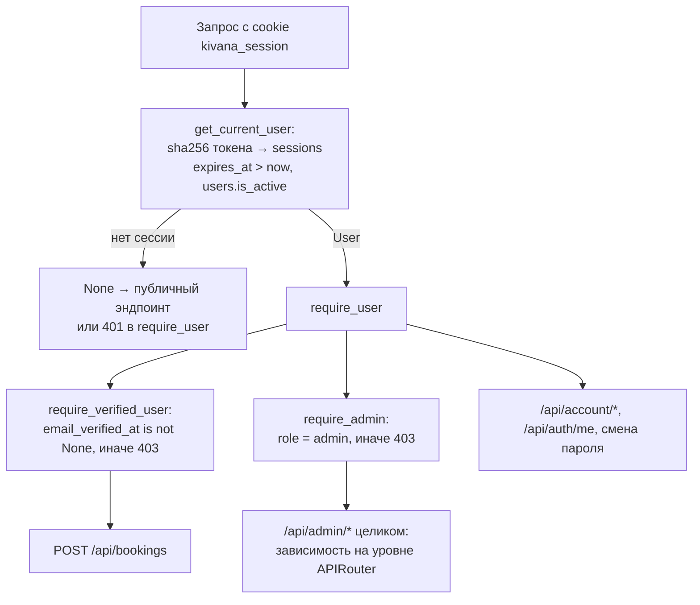
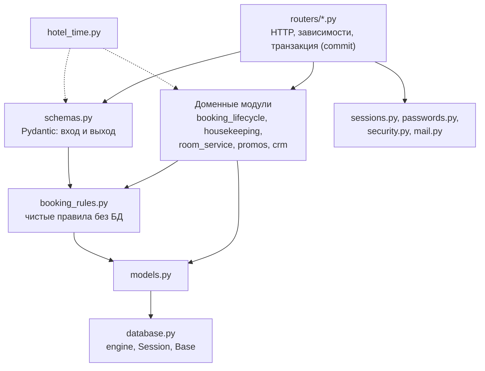
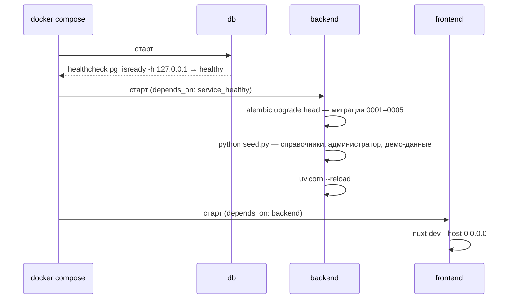

# 02. Архитектура

## Три контейнера и внешняя почта



Все три сервиса описаны в [docker-compose.yml](../docker-compose.yml). Наружу на все интерфейсы открыт только порт 3000. Порты 8000 и 5432 привязаны к `127.0.0.1`: Swagger и psql доступны разработчику на этой машине, но не из сети. Resend вызывается только при `MAIL_BACKEND=resend` (он выбирается сам, если задан `RESEND_API_KEY`); без ключа письма и ссылки из них печатаются в журнал backend, поэтому весь сценарий регистрации проходит без внешних сервисов.

## Ключевое решение: прокси вместо CORS

В [nuxt.config.ts](../frontend/nuxt.config.ts) объявлено правило:

```ts
routeRules: {
  '/api/**': { proxy: `${apiBase}/api/**` },
}
```

Из этого следует цепочка:

1. Код фронта запрашивает относительный путь — `useFetch('/api/rooms')`, `$fetch('/api/auth/login')`. Абсолютных адресов в нём нет.
2. При SSR запрос выполняет сам nitro и проксирует его на `http://backend:8000` по внутренней сети Compose.
3. В браузере запрос уходит на `http://localhost:3000/api/...`, то есть на тот же origin, и nitro снова проксирует его на backend.

Поскольку браузер никогда не обращается к чужому origin, preflight-запросов нет и **CORS-middleware в FastAPI не нужен**. Кабинет и админка ходят на тот же `/api/**`, поэтому и им CORS не нужен.

Прокси пересылает заголовки в обе стороны, и на этом держится вход. Ответ `/api/auth/login` приносит `Set-Cookie: kivana_session`, браузер сохраняет cookie для origin `localhost:3000` и отправляет её со следующими запросами. Cookie `httpOnly`, `SameSite=Lax`, флаг `Secure` включается переменной `COOKIE_SECURE` ([sessions.py](../backend/app/sessions.py)). При SSR страницы `/account` или `/admin` Nuxt пересылает cookie входящего запроса во внутренний запрос: [useCurrentUser.ts](../frontend/app/composables/useCurrentUser.ts) для этого использует `useRequestFetch`, поэтому серверный рендер тоже видит сессию.

Адрес backend берётся из переменной `API_BASE` с дефолтом `http://localhost:8000`, поэтому тот же конфиг работает и вне Docker.

**Trade-off.** Каждый запрос браузера проходит лишний прыжок через Node. Взамен код фронта не знает адресов, не держит переменных окружения в бандле и не требует CORS.

## Аутентификация: где проходит граница



Эта цепочка — всё, что отделяет гостя от администратора: зависимости из [sessions.py](../backend/app/sessions.py). Все админские роутеры объявляют `dependencies=[Depends(require_admin)]` на уровне `APIRouter`, поэтому новый эндпоинт в них защищён по умолчанию. Фронтовый middleware [auth.global.ts](../frontend/app/middleware/auth.global.ts) — только удобство: он сразу редиректит на `/login?next=...`, а настоящая проверка прав всегда на backend.

## IP клиента и его ограничения

Dev-сервер Nuxt ставит заголовок `X-Forwarded-For` с адресом клиента, а прокси `routeRules` пересылает его в backend. Uvicorn доверяет этому заголовку, потому что в compose задано `FORWARDED_ALLOW_IPS: "*"`. Отсюда берётся IP для ограничения частоты в [security.py](../backend/app/security.py).

Лимитеры (`RateLimiter`, счётчики в памяти процесса) заданы тремя парами «по IP плюс общий потолок на весь сайт»:

| Набор | На что вешается | По IP | На весь сайт |
|---|---|---|---|
| `booking_limiters` | `POST /api/bookings` | 5 за 10 минут | 30 за 10 минут |
| `login_limiters` | `POST /api/auth/login` | 10 за 10 минут | 30 за 10 минут |
| `account_limiters` | регистрация, повторное письмо, «забыли пароль», сброс пароля | 10 за 10 минут | 30 за 10 минут |

У схемы есть предел. Если клиент прислал `X-Forwarded-For` сам, dev-сервер Nuxt его не перезаписывает, и лимит по IP обходится подделкой заголовка. Поэтому рядом с лимитом по IP стоит общий потолок, который от IP не зависит. Письма сверх этого ограничены по самому адресу: не чаще раза в минуту и пяти в час на пользователя и цель (`mail_quota_left` в [auth.py](../backend/app/routers/auth.py)). Подробности — в [04-backend.md](04-backend.md), последствия — в [09-tech-debt.md](09-tech-debt.md).

## Слои backend



Разделение держится на трёх правилах:

1. **Правила отдельно от базы.** [booking_rules.py](../backend/app/booking_rules.py) не импортирует Session: `decide()`, `calculate_price()`, `promo_refusal()` получают факты аргументами. Поэтому их проверяют табличные тесты без БД ([test_booking_rules.py](../backend/tests/test_booking_rules.py)), а факты собирает [booking_lifecycle.py](../backend/app/booking_lifecycle.py) в `submit_booking`.
2. **Доменные функции не коммитят.** `change_status`, `create_order`, `create_stay_tasks`, `expire_stale_pending` меняют сессию, а `db.commit()` вызывает роутер. Благодаря этому просрочка, действие, журнал событий и очередь писем составляют одну транзакцию: при ошибке не сохраняется ничего, и письма не уходят (они ставятся в `BackgroundTasks`, которые выполняются только после успешного ответа).
3. **Статус меняет одна функция.** Статус брони — только `change_status`, статус заказа — только `change_order_status`. Мимо них роутеры его не пишут.

## Границы модулей

| Компонент | Знает про | Не знает про |
|---|---|---|
| `frontend/app/pages`, `components` | относительные пути `/api/**`, типы из `types.ts` | базу, порты, имена контейнеров |
| `frontend/app/middleware/auth.global.ts` | `useCurrentUser`, роль из `/api/auth/me` | реальные права (их проверяет backend) |
| `frontend/nuxt.config.ts` | `API_BASE`, `WATCH_POLLING`, `passwordMinLength` | структуру API |
| `backend/app/routers` | модели, схемы, доменные модули, зависимости из `sessions.py` и `security.py` | устройство писем и правил изнутри |
| `backend/app/booking_rules.py` | `models.py` (только перечисления и типы), переменные порогов | Session, HTTP, письма |
| `backend/app/booking_lifecycle.py` | правила, модели, `housekeeping`, `room_service`, `mail`, `hotel_time` | HTTP-запрос (получает `BackgroundTasks` аргументом) |
| `backend/app/sessions.py`, `passwords.py` | `security.py`, модели | бронирование |
| `backend/app/mail.py` | переменные `MAIL_BACKEND`, `RESEND_API_KEY` | модели и бизнес-правила; письма о бронях собирает `mail_templates.py` |
| `backend/app/models.py` | таблицы | HTTP |
| `backend/migrations` | модели и `DATABASE_URL` | приложение FastAPI |
| `backend/seed.py` | модели, `submit_booking`, `change_status`, `create_order` | HTTP-слой |

Направление зависимостей одностороннее: `routers → доменные модули → booking_rules → models → database`. Обратных импортов и циклов нет. Демо-данные сид создаёт теми же функциями, что и API, поэтому журнал событий, уборки и статусы в демо согласованы.

## Архитектурные решения

| Решение | Альтернатива | Почему выбрано |
|---|---|---|
| Сессия — случайный токен в cookie, в таблице `sessions` его sha256 | Подписанная HMAC-cookie (v1.0), JWT | Сессию можно отозвать (выход, смена и сброс пароля); утечка таблицы не даёт токенов. TTL по роли: 14 дней гостю, 12 часов администратору. Цена: запрос к БД на каждый вызов |
| Одна функция `change_status` и таблица `TRANSITIONS` | Свободное переключение статусов (v1.0), проверки в роутерах | Недопустимый переход — 409 в одном месте; журнал `booking_events` и письма создаются ровно по одному на переход |
| Авто-решение — чистая функция `decide()`, пороги из окружения | Правила внутри роутера, ручной разбор всего | Типовая бронь подтверждается сразу; правила проверяются без БД; причины перечисляются все, а не первая |
| Двойная бронь — ограничение `bookings_no_overlap` | Проверка в коде перед UPDATE | Проверка в коде — гонка; ограничение проверяет сама база в момент записи |
| Ленивая просрочка `expire_stale_pending` | Планировщик (cron, Celery) | Нет отдельного процесса; функция идемпотентна и вызывается при каждом чтении списков и действий |
| Письма в `BackgroundTasks` | Очередь (Celery, RQ) | Ответ API не ждёт почту, зависимостей нет. Цена: нет повторных попыток |
| Уборки создаются при подтверждении, снимаются при отмене | Вычислять расписание «на лету» из броней | Гость выбирает слот и админ отмечает выполнение — нужны строки, которые можно менять |
| Сегмент клиента, «Проживание» и «Завершена» вычисляются, а не хранятся | Колонки с кэшем | Нечему рассинхронизироваться: показатели CRM — один агрегирующий запрос `client_select()` без N+1 |
| Цена, скидка, имя и телефон в брони — снимок | Ссылка на текущие значения | Изменение прайса, акции или профиля не меняет уже сделанные брони и заказы |
| «Сегодня» считается в `HOTEL_TZ` (`hotel_time.py`) | `date.today()` по часам сервера | Сервер в UTC: в первые часы московских суток дата была бы вчерашней, а дедлайн отмены и просрочка сдвинулись бы |
| Миграции Alembic при каждом старте | `create_all` (v1.0) | Схема воспроизводима и обновляется без потери данных; сид схему не создаёт |
| Прокси вместо CORS | CORS-middleware | Фронт не знает адресов backend, нет preflight |

## Порядок запуска



Команда backend в [docker-compose.yml](../docker-compose.yml): `sh -c "alembic upgrade head && python seed.py && uvicorn ..."`. Отдельного entrypoint-скрипта нет: `&&` даёт нужный порядок, а если миграция или сид упадут, uvicorn не стартует и причина видна в логах. Типичная причина падения сида — `ADMIN_PASSWORD` или `DEMO_PASSWORD`, не проходящие политику паролей: сид сам проверяет их `check_password` и завершается с понятным сообщением.

Отдельного цикла ожидания базы нет, его заменяет правильный healthcheck. `pg_isready` проверяет базу по TCP через `-h 127.0.0.1`. Через unix-сокет он отвечал бы «готово» ещё во время первичной инициализации тома, когда временный сервер TCP не слушает и база `kivana` может быть не создана.

Подробнее о сиде — в [05-data-model.md](05-data-model.md), о переменных окружения — в [07-infrastructure.md](07-infrastructure.md).

## Вопросы на понимание

1. Почему кабинету и админке тоже не нужен CORS, хотя они работают с cookie? (Запросы идут на тот же origin через прокси nitro; браузер не обращается к чужому адресу.)
2. Почему доменные функции вроде `change_status` не вызывают `db.commit()`? (Просрочка, переход, журнал и письма должны быть одной транзакцией; коммитит роутер, письма уходят только после успешного ответа.)
3. Что даёт хранение в БД только sha256 токена сессии по сравнению с хранением самого токена? (Утечка дампа БД не позволяет войти: по хэшу cookie не восстановить.)
4. Что изменилось бы, если бы healthcheck вызывал `pg_isready` без `-h`? (Он ответил бы «готово» во время инициализации тома, и `alembic upgrade head` упал бы на ещё не созданной базе.)
