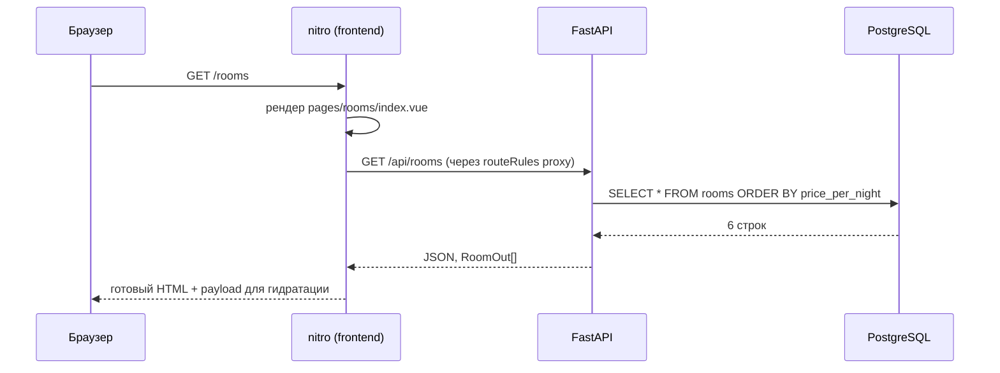
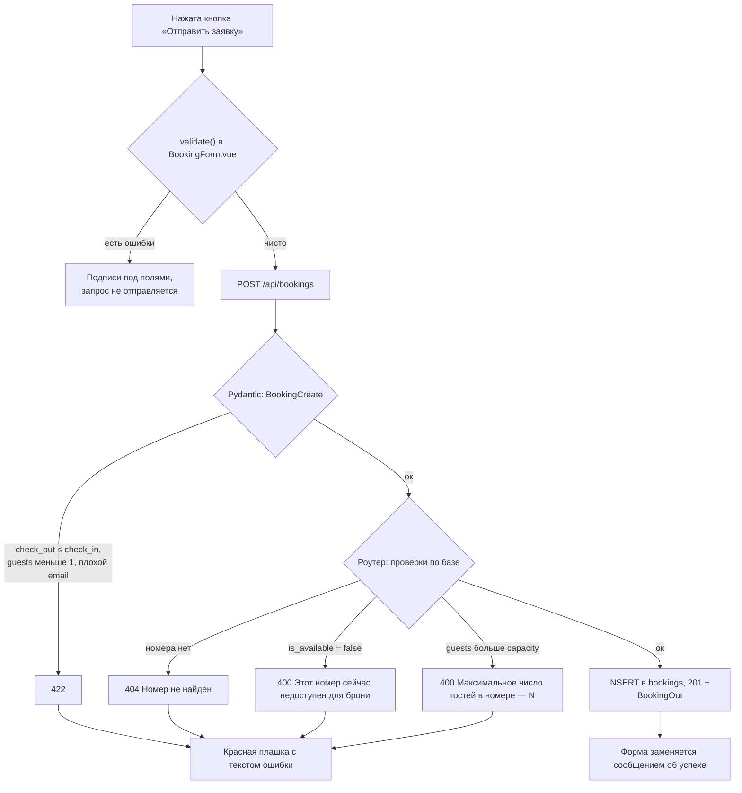

# 03. Рантайм-сценарии

## Сценарий 1: гость открывает каталог



Важная деталь: HTML приходит уже с карточками номеров. Отключённый JavaScript ломает фильтры, но не ломает содержимое страницы.

## Сценарий 2: гость применяет фильтр

Фильтры в [pages/rooms/index.vue](../frontend/app/pages/rooms/index.vue) — два `select`, связанные с `ref`. Они собираются в вычисляемый объект:

```ts
const query = computed(() => ({
  ...(capacity.value ? { capacity: capacity.value } : {}),
  ...(maxPrice.value ? { max_price: maxPrice.value } : {}),
}))
const { data: rooms, status } = await useFetch<Room[]>('/api/rooms', { query })
```

`useFetch` отслеживает реактивный `query` и сам повторяет запрос при его изменении. Значение `0` означает «фильтр не выбран» и в query-строку не попадает — поэтому «любая цена» и «до 3 000 ₽» дают разные URL, а не одинаковые с нулём.

Фильтрация выполняется в SQL, в [rooms.py](../backend/app/routers/rooms.py):

```python
if capacity is not None:
    query = query.where(Room.capacity >= capacity)
if max_price is not None:
    query = query.where(Room.price_per_night <= max_price)
```

Пустая выдача — не ошибка: API возвращает `[]` со статусом 200, страница показывает блок «Ничего не найдено» с кнопкой сброса.

Почему `select`, а не поле ввода цены: реактивный `useFetch` шлёт запрос на каждое изменение значения, и текстовое поле породило бы запрос на каждую нажатую цифру. Готовые пороги убирают проблему без debounce.

## Сценарий 3: гость отправляет заявку



Валидация живёт на двух уровнях, и это не дублирование ради дублирования:

- **Клиент** ([BookingForm.vue](../frontend/app/components/BookingForm.vue)) отвечает за скорость реакции. Он знает вместимость номера из props и может сказать про превышение мест, не спрашивая сервер.
- **Pydantic** ([schemas.py](../backend/app/schemas.py)) закрывает всё, что видно из самого тела запроса: длину имени, формат почты, минимум одного гостя, дату выезда позже даты заезда. Ответ — 422 со списком проблемных полей.
- **Роутер** ([bookings.py](../backend/app/routers/bookings.py)) закрывает то, для чего нужна база: существование номера, его доступность и вместимость. Ответ — 404 или 400 с человекочитаемым русским текстом.

Клиентские проверки полностью повторяются на сервере. Обойти форму через curl и создать заявку на пять гостей в одноместном номере нельзя.

## Сценарий 4: гость открывает несуществующий номер

`useFetch` на `/api/rooms/net-takogo` получает 404, `data` остаётся `null`, и страница карточки номера бросает:

```ts
throw createError({ statusCode: 404, statusMessage: 'Номер не найден', fatal: true })
```

Nuxt отвечает браузеру честным статусом 404 и своей страницей ошибки. В dev-режиме это сопровождается стектрейсом в логах контейнера — так и задумано, в проде страница ошибки выводится без него.

## Сценарий 5: повторный запуск

`docker compose up` во второй раз не пересоздаёт данные. Функция `seed` считает строки в `rooms` и при непустой таблице печатает «База уже заполнена, сид пропущен» и выходит. Именно поэтому повторный запуск безопасен, а `docker compose down -v` (удаление тома) возвращает базу к шести номерам с нуля.

## Вопросы на понимание

1. Какой HTTP-статус вернёт заявка, где дата выезда равна дате заезда, и почему не 400?
2. Что увидит пользователь, если фильтр не нашёл ни одного номера?
3. Почему клиентская валидация не делает серверную избыточной?
