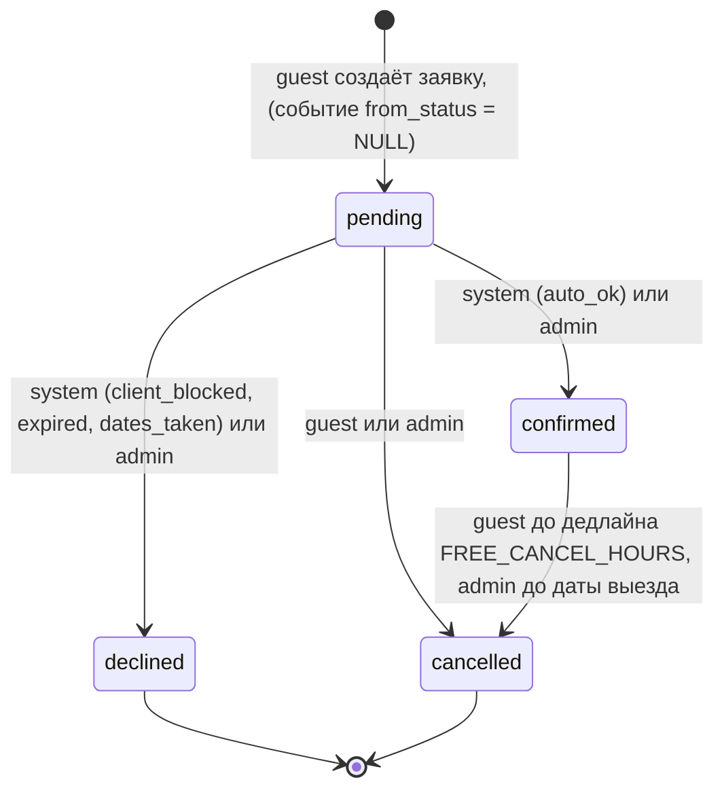
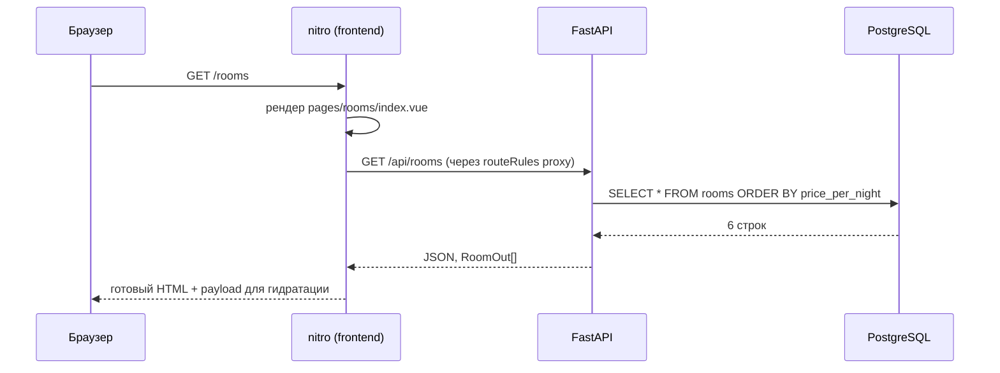
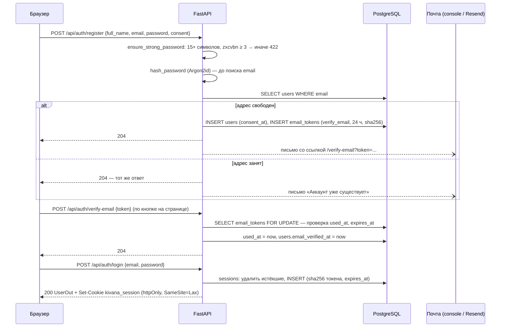
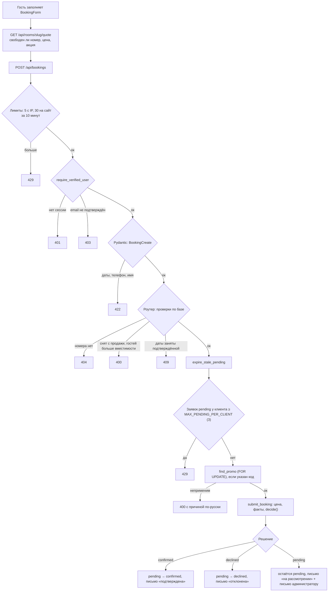
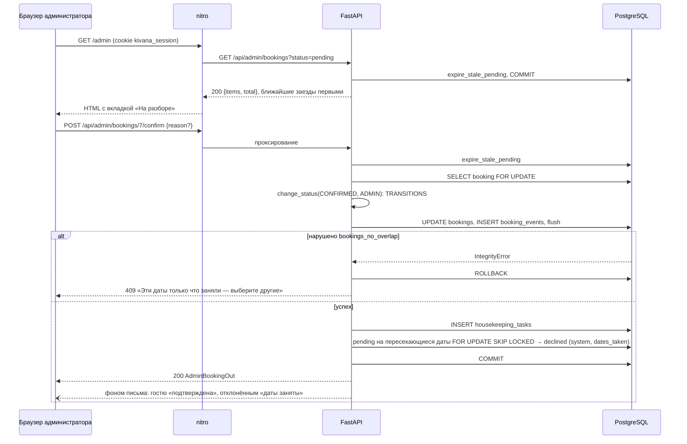
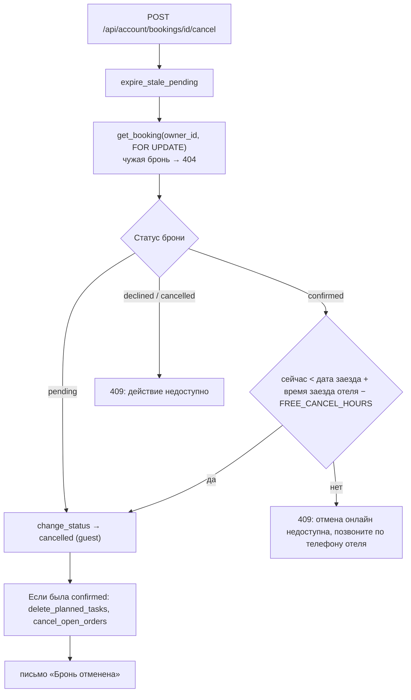
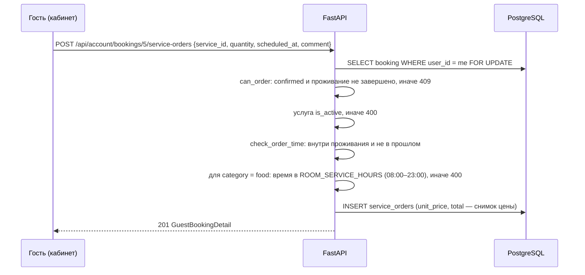
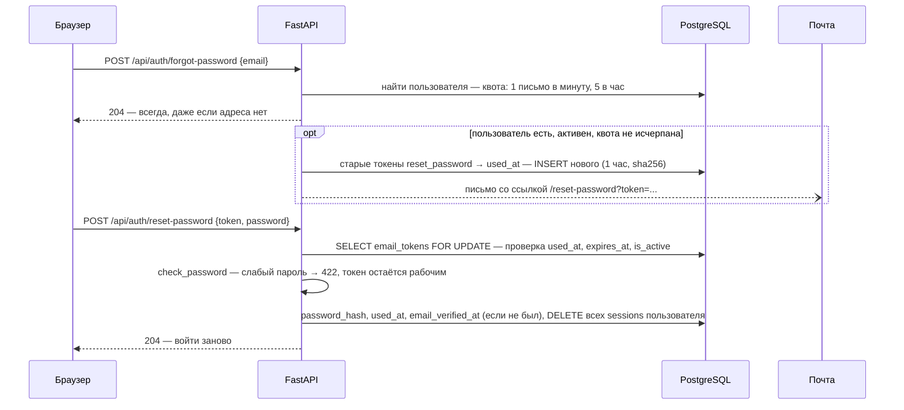

# 03. Рантайм-сценарии

Документ описывает систему в динамике. Статические части — в [02-architecture.md](02-architecture.md) (компоненты, порядок запуска) и [05-data-model.md](05-data-model.md) (таблицы и ограничения). Эндпоинты и сервисы — в [04-backend.md](04-backend.md), страницы — в [06-frontend.md](06-frontend.md).

## Жизненный цикл брони

Статус брони — строка в `bookings.status`; допустимые значения закреплены CHECK-ограничением `bookings_status_check`. Перейти из одного статуса в другой можно только по таблице `TRANSITIONS` в [booking_lifecycle.py](../backend/app/booking_lifecycle.py): перехода нет в таблице или его выполняет не тот актор — ответ 409. Статус не «откатывается»: из `declined` и `cancelled` пути нет.

| Переход | Кто | Что ещё происходит |
|---|---|---|
| `∅ → pending` | guest | Строка `bookings`, событие в `booking_events`; письма нет. Сразу за ним `submit_booking` применяет авто-решение |
| `pending → confirmed` | system, admin | `decided_by`, `create_stay_tasks` (уборки), пересекающиеся `pending` отклоняются с кодом `dates_taken`, письмо «Бронь подтверждена» |
| `pending → declined` | system, admin | `decided_by`, письмо «Заявка отклонена» с причинами; промокод освобождается |
| `pending → cancelled` | guest, admin | `cancelled_by`, `cancelled_at`, письмо об отмене; промокод освобождается |
| `confirmed → cancelled` | guest, admin | То же, плюс `delete_planned_tasks` (снимаются запланированные уборки) и `cancel_open_orders` (заказы `new` и `accepted` отменяются от имени system) |

Ещё два статуса **вычисляются** и не хранятся ([booking_rules.py](../backend/app/booking_rules.py), `display_status`): подтверждённая бронь с `check_in <= сегодня < check_out` показывается как «Проживание» (`in_stay`), с `check_out <= сегодня` — как «Завершена» (`completed`). Хранить их нечем: они менялись бы сами с датой, а планировщика нет.

Каждый переход пишет в `booking_events` строку: `from_status`, `to_status`, `actor` (`guest`, `admin`, `system`), `actor_user_id`, коды причин и текст администратора. Журнал только растёт, его читают кабинет и админка ([BookingTimeline.vue](../frontend/app/components/BookingTimeline.vue)).

Те же идеи, но проще, у двух других сущностей: заказ услуги `new → accepted → done` или `→ cancelled` (`ORDER_TRANSITIONS` в [room_service.py](../backend/app/room_service.py)) и уборка `planned → done/skipped` (`set_task_status`, переходы туда-обратно разрешены, чтобы поправить ошибочную отметку).

## Сценарий 1: гость открывает каталог

HTML приходит уже с карточками номеров. Отключённый JavaScript ломает фильтры, но не содержимое страницы.

Фильтры в [pages/rooms/index.vue](../frontend/app/pages/rooms/index.vue) — два `select` (вместимость и максимальная цена), собранные в вычисляемый `query`. `useFetch` повторяет запрос при его изменении; значение `0` означает «фильтр не выбран» и в query-строку не попадает. Фильтрация выполняется в SQL ([rooms.py](../backend/app/routers/rooms.py)): `capacity >= ?` и `price_per_night <= ?`. Пустая выдача — не ошибка: API возвращает `[]` со статусом 200, а если backend не ответил, страница показывает отдельное сообщение об ошибке загрузки. `select`, а не поле ввода цены, потому что реактивный `useFetch` слал бы запрос на каждую цифру.

Карточка номера `/rooms/{slug}`: ответ 404 превращается в `createError(404)` и рендерится [error.vue](../frontend/app/error.vue) «Такой страницы нет»; любой другой сбой — 503 «Сайт временно недоступен».

## Сценарий 2: регистрация, подтверждение почты, вход

Решения, которые стоят за этой картинкой:

- **Одинаковый ответ на занятый адрес.** Форма регистрации не должна раскрывать, есть ли аккаунт. Поэтому пароль проверяется и хэшируется до поиска email (одинаковое время ответа), ответ всегда 204, а владельцу существующего адреса уходит письмо «Аккаунт уже существует». Параллельная регистрация того же адреса ловится `IntegrityError` на уникальном индексе и отвечает так же.
- **Подтверждение только POST.** Почтовые сканеры заранее открывают ссылки GET-запросом; подтверждение по GET сработало бы без человека. Страница [verify-email.vue](../frontend/app/pages/verify-email.vue) показывает кнопку и шлёт POST. Токен гасится под `FOR UPDATE`: при двойном клике второй запрос увидит `used_at` и получит 400.
- **Вход без раскрытия адреса.** Для несуществующего email пароль всё равно проверяется (`DUMMY_PASSWORD_HASH`), поэтому ответ не быстрее. При входе параметры хэша обновляются (`needs_rehash`), сохраняется `last_login_at`.
- **Неподтверждённый гость входить может.** Он видит кабинет с баннером и кнопкой повторной отправки (`POST /api/auth/resend-verification`: не чаще раза в минуту и пяти в час), но создать бронь не может — `require_verified_user` вернёт 403.
- **Cookie.** Вход создаёт сессию, TTL — 14 дней для гостя, 12 часов для администратора (`session_ttl`). Выход удаляет строку и cookie; сессии на других устройствах не затрагиваются.

Защищённые страницы проверяет [auth.global.ts](../frontend/app/middleware/auth.global.ts): до рендера он спрашивает `/api/auth/me` и либо редиректит на `/login?next=...`, либо (гость на `/admin`) на `/account`.

## Сценарий 3: гость отправляет заявку, система принимает решение

Проверки разложены по уровням, и каждый отвечает за своё:

- **Клиент** ([BookingForm.vue](../frontend/app/components/BookingForm.vue)) отвечает за скорость реакции: поля, даты, вместимость. Дополнительно форма сама запрашивает котировку `GET /api/rooms/{slug}/quote`; кнопка отправки неактивна, пока номер не свободен. Котировку и бронь считает одна функция `calculate_price`, поэтому сумма в форме равна сумме в брони.
- **Pydantic** ([schemas.py](../backend/app/schemas.py), `StayIn`, `BookingCreate`) закрывает всё, что видно из тела запроса, и отвечает 422: заезд не в прошлом и не дальше `MAX_LEAD_DAYS` (365), выезд позже заезда, не больше `MAX_STAY_NIGHTS` (30) ночей, гостей 1–20, телефон, имя, комментарий до 1000 символов.
- **Роутер** ([bookings.py](../backend/app/routers/bookings.py)) закрывает то, для чего нужна база: номер, доступность, вместимость, пересечение с подтверждённой бронью, лимит заявок на рассмотрении и промокод.

Лимит заявок на рассмотрении считается после `expire_stale_pending`, а промокод проверяется после него же: просроченная заявка уже освободила место в лимите и свой код.

### Авто-решение

`submit_booking` собирает факты запросами (есть ли у клиента завершённое проживание, есть ли `pending` на те же даты) и передаёт их в чистую функцию `decide()` ([booking_rules.py](../backend/app/booking_rules.py)). Порядок проверки: **отказ → ручной разбор → подтверждение**. Отказ первым, потому что он окончательный и причины разбора для отклонённой брони ничего не значат. Причины разбора собираются все, а не первая, чтобы администратор сразу видел, что проверить.

| Код причины | Итог | Условие | Порог (переменная) |
|---|---|---|---|
| `client_blocked` | declined | `users.crm_status = 'blocked'`. Гость видит нейтральный текст, а не причину | — |
| `pending_conflict` | pending | На эти даты в номере уже есть заявка на рассмотрении | — |
| `long_stay` | pending | Ночей больше порога; для VIP не применяется | 7 (`AUTO_CONFIRM_MAX_NIGHTS`) |
| `high_total` | pending | Сумма после скидки больше порога, а завершённых проживаний у клиента нет; для VIP не применяется | 60 000 ₽ (`AUTO_CONFIRM_MAX_TOTAL`) |
| `same_day` | pending | Заезд сегодня | — |
| `far_future` | pending | Заезд дальше порога; для VIP не применяется | 180 дней (`AUTO_CONFIRM_MAX_LEAD_DAYS`) |
| `has_comment` | pending | К заявке есть комментарий | — |
| `auto_ok` | confirmed | Ни одно правило не сработало | — |
| `expired` | declined | Заявку не рассмотрели до даты заезда (сценарий 6) | — |
| `dates_taken` | declined | Эти даты подтвердили в другой брони (сценарий 4) | — |

Последние две причины выставляет не `decide()`, а `expire_stale_pending` и каскад подтверждения. Тексты причин для гостя, писем и журнала — в `REASON_TEXTS`.

В журнале автоматическое подтверждение выглядит как два события: `∅ → pending` (guest) и `pending → confirmed` (system, причина `auto_ok`). Гость при этом получает **одно** письмо, об итоге: событие создания письма не отправляет. Если заявка осталась на рассмотрении, письмо «на рассмотрении» с причинами отправляет роутер, а при заданном `ADMIN_NOTIFY_EMAIL` — ещё и администратору.

Все письма — фоновые задачи (`BackgroundTasks`): они выполняются после ответа и только если транзакция зафиксирована. Сбой доставки пишется в журнал и заявку не ломает.

## Сценарий 4: администратор решает вручную

Ключевые моменты:

- **Подтверждение защищено ограничением базы, а не проверкой в коде.** Два администратора могут одновременно нажать «Подтвердить» на пересекающихся заявках. Проверка в коде пропустила бы обе, а база примет только первую; вторая получит 409. `change_status` ловит `IntegrityError` при `flush()` и откатывает всю транзакцию целиком.
- **Блокировки.** Бронь читается `FOR UPDATE`, поэтому два перехода одной брони идут по очереди. Каскадное отклонение и просрочка берут строки `FOR UPDATE SKIP LOCKED`: заявки, которые прямо сейчас меняет другой запрос, пропускаются, и взаимных блокировок нет.
- **Причина.** Подтверждение принимает необязательный `reason`, отклонение и отмена требуют его (`AdminReasonIn`). Текст попадает в `reason_text`, в событие и в письмо гостю.
- **Каскад подтверждения.** Подтверждённая бронь закрывает даты, поэтому пересекающиеся заявки на рассмотрении теряют смысл: они отклоняются с кодом `dates_taken` и получают свои письма. Глубина рекурсии ровно 1: переход в `declined` дальше ничего не каскадирует.
- **Отмена подтверждённой брони администратором** возможна до даты выезда (`check_out`); после — 409 «Проживание уже закончилось».

Когда сессия истекла, любое действие получает 401; админские страницы чистят состояние пользователя и ведут на `/login?next=/admin`.

## Сценарий 5: гость отменяет бронь

Дедлайн считает `guest_cancel_deadline`: `hotel_datetime(check_in, hotel.check_in_time) − FREE_CANCEL_HOURS` (по умолчанию 48 часов). При времени заезда 14:00 и заезде 10 октября гость отменяет сам до 14:00 8 октября; позже — по телефону, и тогда отменяет администратор. Тот же расчёт отдаёт кабинету поля `cancel_deadline` и `can_cancel`, поэтому кнопка исчезает ровно тогда, когда backend ответил бы 409. Заявку на рассмотрении гость отменяет в любой момент. Освободившиеся даты и промокод доступны сразу: даты блокирует только `confirmed`, а код считается занятым лишь для `pending` и `confirmed`.

## Сценарий 6: ленивая просрочка заявок

Планировщика нет. `expire_stale_pending` отклоняет заявки `pending` с `check_in < сегодня` (по `HOTEL_TZ`): переход `pending → declined`, актор `system`, причина `expired`, письмо гостю. Заявка на сегодняшний заезд не просрочена: она ушла на ручной разбор по правилу `same_day`, и у администратора есть весь день.

Вызывается функция при каждом обращении, где устаревший статус мог бы быть замечен или помешать:

| Где | Зачем |
|---|---|
| `POST /api/bookings` | Просроченные заявки не занимают лимит `MAX_PENDING_PER_CLIENT` и не держат промокод |
| `GET /api/account/bookings`, `GET .../{id}`, `POST .../cancel` | Гость не видит заявку «на рассмотрении» с прошедшей датой |
| `GET /api/admin/bookings`, `GET .../{id}`, `GET /api/admin/clients/{id}`, confirm/decline/cancel | Администратор не разбирает заявку, которую уже нельзя подтвердить |

Функция идемпотентна: повторный вызов ничего не найдёт. Строки берутся `FOR UPDATE SKIP LOCKED`, чтобы не ждать параллельный запрос. В читающих эндпоинтах роутер коммитит сразу, в действиях просрочка идёт в одной транзакции с самим действием: если действие закончится ошибкой, откатятся и статусы, и письма. Цена решения: статус «залежавшейся» заявки меняется не в момент наступления даты, а при следующем обращении. Для гостиницы этого достаточно, и отдельный процесс не нужен.

## Сценарий 7: заказ услуги или еды в номер

- **Окно заказа.** От `check_in + check_in_time` до `check_out + check_out_time` отеля, не в прошлом. Время без пояса (поле `datetime-local`) считается временем отеля (`ServiceOrderIn.attach_hotel_zone`).
- **Еда и кухня.** Только услуги с категорией `food` проверяются по `ROOM_SERVICE_HOURS`; конец интервала не включается: на 23:00 уже не готовят. Остальные категории (`housekeeping`, `transfer`, `wellness`, `other`) заказываются в любое время проживания.
- **Количество.** Для `unit = per_stay` количество принудительно 1, для `per_item` — от 1 до 20.
- **Цена — снимок.** `unit_price` и `total` записываются в заказ: изменение каталога уже сделанные заказы не меняет. Итог по услугам в брони (`services_total`) исключает отменённые и нужен только для показа: оплата на ресепшене.
- **Блокировка брони** `FOR UPDATE` ставит заказ и параллельную отмену брони в очередь: заказ к уже отменённой брони не пройдёт.
- **Статусы заказа.** Администратор ведёт `new → accepted → done` ([admin_services.py](../backend/app/routers/admin_services.py)). Гость отменяет только `new`; администратор — `new` и `accepted`; при отмене брони все `new` и `accepted` снимаются автоматически (`cancel_open_orders`), выполненные остаются в истории.

## Сценарий 8: уборка — генерация и смена слота

**Генерация.** При подтверждении брони `create_stay_tasks` создаёт строки `housekeeping_tasks`: ежедневную уборку (`daily`) на каждую дату **строго между** заездом и выездом и одну уборку после выезда (`checkout`) на дату выезда. Заезд и выезд ежедневной уборкой не покрываются, поэтому проживание на одну ночь даёт только `checkout`. Слот по умолчанию — `morning`. Уникальность `(booking_id, date, kind)` не даст создать дубль. Не подтверждённая бронь персонал не занимает: до подтверждения строк нет.

**Смена слота гостем.** `PATCH /api/account/housekeeping/{task_id}` с `slot` из `morning` (09–12), `day` (12–15), `evening` (15–18) или `dnd` («не беспокоить»). Менять можно только запланированную ежедневную уборку на дату позже сегодняшней (`guest_can_change_slot`): сегодняшняя уже в работе, а после выезда время выбирать незачем. Иначе 409. Чужая задача — 404, как и чужая бронь.

**Работа администратора.** `GET /api/admin/housekeeping?date=...` отдаёт расписание дня (`day_board`): уборки после выезда (сначала те, где в номер в тот же день заезжает подтверждённая бронь), ежедневные по слотам, список «не беспокоить» и заказы услуг категории `housekeeping` на эту дату. Отметка `PATCH /api/admin/housekeeping/{id}` ставит `done` (с `done_at`) или `skipped`.

**Отмена.** При отмене подтверждённой брони `delete_planned_tasks` удаляет запланированные уборки; выполненные и пропущенные остаются в истории. Расписание дня и так показывает только задачи подтверждённых броней.

## Сценарий 9: сброс пароля

Тонкости: ответ `forgot-password` одинаков всегда, по нему нельзя проверить наличие аккаунта; квота считается по адресу, а не только по IP, иначе чужой ящик завалили бы письмами с разных адресов. Новый токен гасит прежние невостребованные токены той же цели. Токен гасится только после проверки пароля, поэтому слабый пароль можно исправить и отправить снова с той же ссылкой. Сброс подтверждает email (ссылку открыл владелец ящика) и **завершает все сессии**: если пароль украли, злоумышленник теряет вход. Смена пароля из кабинета (`POST /api/auth/change-password`) требует текущий пароль и завершает все сессии, кроме текущей.

## Сценарий 10: повторный запуск и сбои

**Повторный запуск.** `alembic upgrade head` при уже применённых миграциях ничего не делает. Сид идемпотентен поблочно ([seed.py](../backend/seed.py)): гостиница добавляется, только если таблица `hotels` пуста; номера и услуги добавляются по недостающим `slug`; администратор создаётся, если нет пользователя с таким email (его пароль не меняется никогда); демо-блок пропускается целиком, если демо-клиенты уже есть. Правка цены в `seed.py` на заполненной базе ничего не изменит: цены правятся через админку или миграцией. `docker compose down -v` удаляет том и возвращает базу к начальному состоянию.

**Что происходит при сбоях.**

| Сбой | Поведение |
|---|---|
| Backend недоступен | `useFetch` не бросает исключение, а заполняет `error`: каталог и главная показывают «Не удалось загрузить номера», контакты — своё сообщение, карточка номера отдаёт 503. Шапка и подвал рендерятся как обычно |
| Доставка письма не удалась | Исключение логируется (`logger.exception`), ответ API и сохранённые данные не меняются. Повторных попыток нет |
| Перезапуск backend между сохранением и отправкой письма | Письмо теряется, бронь и её статус остаются; гость увидит итог в кабинете |
| Ошибка внутри действия с просрочкой | Откатывается вся транзакция: статусы, события и письма просрочки тоже |
| Две параллельные брони на один промокод | `find_promo(lock=True)` блокирует строку акции: вторая увидит первую и получит 400 «уже использован» |
| Параллельное подтверждение пересекающихся броней | `bookings_no_overlap` пропускает первую, вторая получает 409 |
| Миграция или сид упали при старте | `&&` не запускает uvicorn; причина в `docker compose logs backend` |
| Нет `RESEND_API_KEY` | Бэкенд почты `console`: письма и ссылки печатаются в журнал backend |

## Вопросы на понимание

1. Гость подтверждённой брони на заезд 10 октября 14:00 хочет отменить её 9 октября в 10:00 при `FREE_CANCEL_HOURS=48`. Что ответит API и почему? (409: дедлайн был 8 октября 14:00; сообщение с телефоном отеля, отменить может только администратор.)
2. Почему при автоматическом подтверждении в журнале два события, а гость получает одно письмо? (Создание `∅ → pending` письма не шлёт; письмо уходит только по итоговому переходу `pending → confirmed`.)
3. Администратор подтверждает заявку, а на те же даты есть две заявки на рассмотрении. Что произойдёт с ними и с их письмами? (Каскад отклоняет их с `dates_taken` от имени system; каждый гость получает письмо об отклонении.)
4. Что произойдёт с заявкой на рассмотрении, если её дата заезда прошла, а администратор и гость на сайт не заходили? (Ничего до первого обращения к спискам или действиям: затем `expire_stale_pending` отклонит её с кодом `expired`.)
