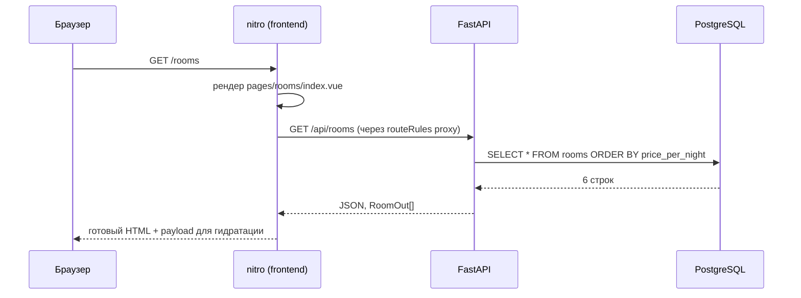
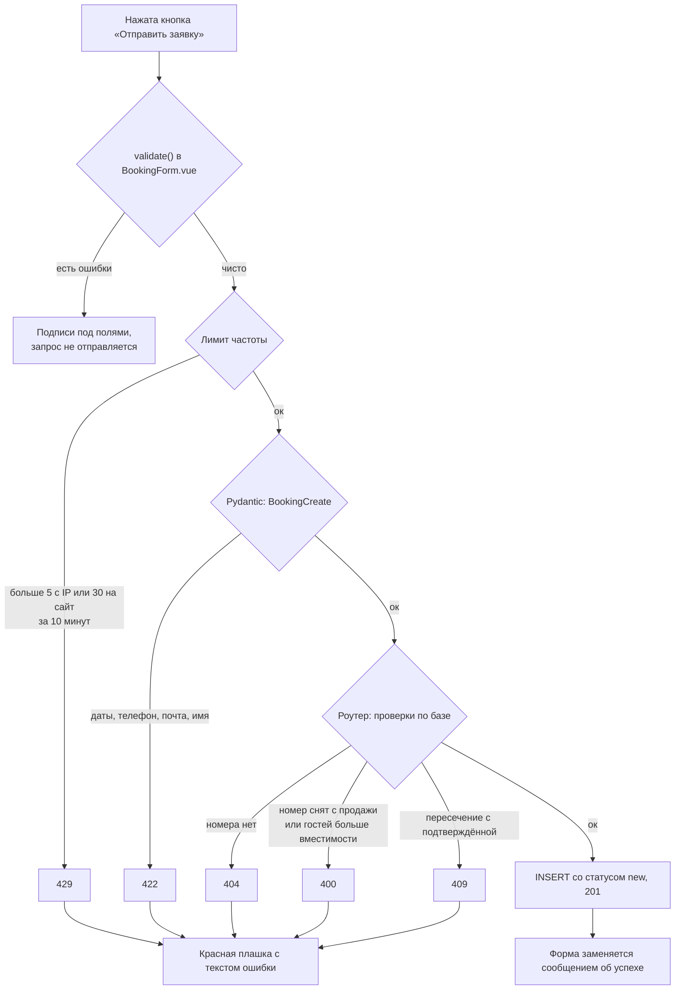
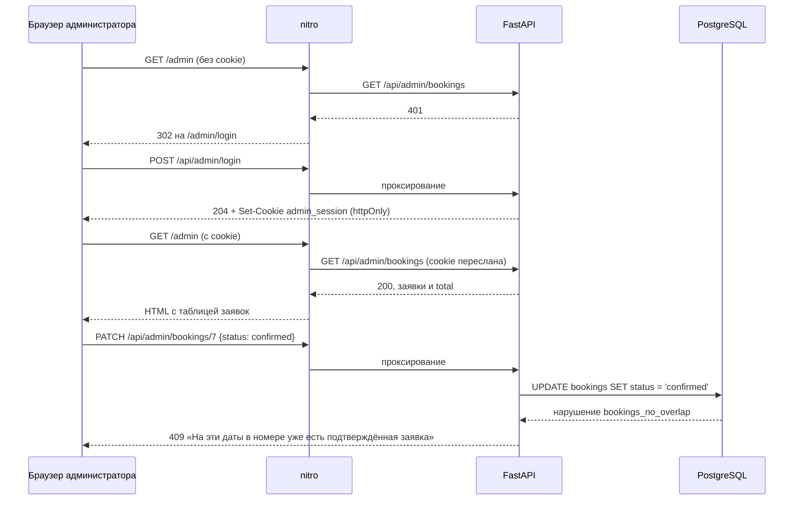

# 03. Рантайм-сценарии

## Сценарий 1: гость открывает каталог



HTML приходит уже с карточками номеров. Отключённый JavaScript ломает фильтры, но не содержимое страницы.

## Сценарий 2: гость применяет фильтр

Фильтры в [pages/rooms/index.vue](../frontend/app/pages/rooms/index.vue) — два `select`, связанные с `ref`. Они собираются в вычисляемый объект:

```ts
const query = computed(() => ({
  ...(capacity.value ? { capacity: capacity.value } : {}),
  ...(maxPrice.value ? { max_price: maxPrice.value } : {}),
}))
const { data: rooms, status, error } = await useFetch<Room[]>('/api/rooms', { query })
```

`useFetch` отслеживает реактивный `query` и повторяет запрос при его изменении. Значение `0` означает «фильтр не выбран» и в query-строку не попадает.

Фильтрация выполняется в SQL, в [rooms.py](../backend/app/routers/rooms.py). Пустая выдача — не ошибка: API возвращает `[]` со статусом 200, страница показывает «Ничего не найдено» с кнопкой сброса. Если же backend не ответил, страница показывает отдельное сообщение об ошибке загрузки, а не «ничего не найдено».

Почему `select`, а не поле ввода цены: реактивный `useFetch` шлёт запрос на каждое изменение, и текстовое поле породило бы запрос на каждую цифру.

## Сценарий 3: гость отправляет заявку



Проверки разложены по трём уровням, и каждый отвечает за своё:

- **Клиент** ([BookingForm.vue](../frontend/app/components/BookingForm.vue)) отвечает за скорость реакции: пустые поля, формат почты, число цифр в телефоне, дату в прошлом, порядок дат, вместимость из props. Запрос не уходит, пока форма не чиста.
- **Pydantic** ([schemas.py](../backend/app/schemas.py)) закрывает всё, что видно из самого тела запроса, и отвечает 422. Русский текст несут только собственные валидаторы: дата в прошлом, порядок дат, телефон. Форма показывает этот текст, а на остальные 422 выводит общее сообщение.
- **Роутер** ([bookings.py](../backend/app/routers/bookings.py)) закрывает то, для чего нужна база: существование и доступность номера, вместимость и пересечение с подтверждёнными заявками.

Проверка пересечения при создании заявки — обычный запрос: есть ли подтверждённая заявка на этот номер, у которой `check_in < новый check_out` и `check_out > новый check_in`. Интервалы полуоткрытые, поэтому выезд одного гостя и заезд другого в тот же день не конфликтуют. Гонки здесь не страшны: новая заявка даты не закрывает, а подтверждение защищено ограничением базы, см. сценарий 6.

## Сценарий 4: гость открывает несуществующий номер

`useFetch` на `/api/rooms/net-takogo` получает 404, и страница карточки номера бросает фатальную ошибку. Код ошибки зависит от причины:

```ts
throw error.value?.statusCode === 404
  ? createError({ statusCode: 404, message: 'Номер не найден', fatal: true })
  : createError({ statusCode: 503, message: 'Сайт временно недоступен', fatal: true })
```

Nuxt отвечает браузеру этим статусом и рендерит [error.vue](../frontend/app/error.vue): «Такой страницы нет» для 404 и «Что-то пошло не так» для остальных. Клиент, который не просит HTML, например curl без заголовка `Accept`, получает вместо страницы JSON с описанием ошибки.

## Сценарий 5: backend недоступен

`useFetch` не бросает исключение, а заполняет `error`. Страницы проверяют его явно: каталог и главная показывают «Не удалось загрузить номера», контакты — «Не удалось загрузить контакты», карточка номера отдаёт 503. Шапка и подвал рендерятся как обычно, сайт не падает целиком.

## Сценарий 6: администратор обрабатывает заявки



Подтверждение защищено не проверкой в коде, а ограничением `bookings_no_overlap` в базе. Два администратора могут одновременно нажать «Подтвердить» на пересекающихся заявках. Проверка в коде пропустила бы обе, а база примет только первую, и вторая получит 409.

Если сессия истекла, любое действие в админке получает 401, и страница переводит администратора на вход.

## Сценарий 7: повторный запуск

`alembic upgrade head` при уже применённой миграции ничего не делает. `seed.py` видит непустую таблицу `rooms`, печатает «База уже заполнена, сид пропущен» и выходит. Поэтому повторный `docker compose up` безопасен, а `docker compose down -v` возвращает базу к шести номерам без заявок.

## Вопросы на понимание

1. Почему пересечение при создании заявки проверяется в коде, а при подтверждении — ограничением базы?
2. Какой код вернёт заявка с датой заезда вчера и где именно её отклонят?
3. Что увидит гость на странице каталога, если контейнер backend остановлен?
