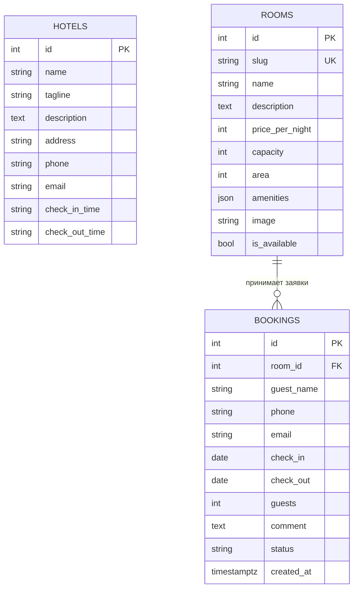

# 05. Модель данных

Три таблицы. Модели — в [models.py](../backend/app/models.py), схема базы — в миграции [0001_initial.py](../backend/migrations/versions/0001_initial.py). Источник истины для схемы — миграции: модели описывают колонки и связи, а ограничения, которые SQLAlchemy-моделью не выражаются, живут только в миграции.

## Схема

Таблица `hotels` ни с чем не связана: гостиница одна.

## Ограничения на `bookings`

| Имя | Правило | Зачем |
|---|---|---|
| `bookings_dates_check` | `check_out > check_in` | Защита от кривых данных в обход API; без неё `daterange` в ограничении ниже упал бы с ошибкой |
| `bookings_guests_check` | `guests >= 1` | То же правило, что в Pydantic, но на уровне базы |
| `bookings_status_check` | `status IN ('new', 'confirmed', 'cancelled')` | Статус — строка, и база не примет опечатку |
| `bookings_no_overlap` | `EXCLUDE USING gist (room_id WITH =, daterange(check_in, check_out) WITH &&) WHERE (status = 'confirmed')` | Два подтверждённых заезда в один номер на пересекающиеся даты невозможны |
| `ix_bookings_room_id` | индекс | Выборки заявок по номеру без полного сканирования |

### Как работает `bookings_no_overlap`

EXCLUDE-ограничение запрещает две строки, для которых все перечисленные сравнения истинны. Здесь это «тот же номер» и «диапазоны дат пересекаются». Условие `WHERE` сужает проверку до подтверждённых заявок, поэтому новые и отменённые заявки могут пересекаться сколько угодно.

`daterange(check_in, check_out)` по умолчанию полуоткрытый: `[check_in, check_out)`. День выезда в диапазон не входит, поэтому выезд одного гостя и заезд другого в тот же день не конфликтуют.

Сравнивать целое число оператором `=` в gist-индексе PostgreSQL умеет только с расширением `btree_gist`. Миграция включает его первой строкой. Расширение входит в стандартную поставку PostgreSQL, в том числе в образ `postgres:16-alpine`.

Почему ограничение, а не проверка в коде. Проверка «нет ли подтверждённой заявки на эти даты» с последующим `UPDATE` — это гонка: два одновременных подтверждения обе пройдут проверку и обе запишутся. Ограничение проверяет сама база в момент записи, и вторая транзакция получит ошибку. В коде при создании заявки проверка всё равно есть, но ради понятного сообщения гостю, а не ради гарантии.

## Решения по типам

**Цена — `int` в рублях.** Дробных цен в предметной области нет, целое число избавляет от вопросов округления.

**Время заезда и выезда — строки `"14:00"`.** Это надпись на стойке, а не момент времени.

**Статус — строка с CHECK, а не ENUM PostgreSQL.** Добавить значение в PG ENUM можно, а удалить или переименовать — только пересоздав тип. Строка с CHECK меняется одной миграцией. В Python статусы перечислены в `BookingStatus(StrEnum)`, Pydantic проверяет по нему входящие значения.

**Удобства — JSON-массив строк.** Одна колонка вместо двух таблиц и join. Цена — по удобствам нельзя искать через индекс.

**Изображение — путь вида `/images/rooms/lyuks.svg`.** Файлы лежат в [frontend/public/images/rooms/](../frontend/public/images/rooms/). Загрузки файлов в проекте нет.

**Slug в URL номера.** Адрес `/rooms/lyuks` читается человеком и не зависит от числовых идентификаторов. Колонка уникальна.

**`created_at` ставит PostgreSQL** через `server_default=func.now()`, у базы одни часы на всех.

## Как меняется схема

1. Поменяйте модель в [models.py](../backend/app/models.py).
2. Создайте миграцию: `docker compose exec backend alembic revision --autogenerate -m "что изменилось"`.
3. Прочитайте сгенерированный файл в `backend/migrations/versions/`. Autogenerate не отслеживает CHECK- и EXCLUDE-ограничения, их изменения дописываются вручную через `op.execute` или `op.create_check_constraint`.
4. Перезапустите backend: `alembic upgrade head` выполнится при старте.

Команда `docker compose exec backend alembic check` сверяет модели с базой и сообщает, если миграция забыта. Тесты накатывают все миграции на пустую базу при каждом прогоне, поэтому сломанная миграция уронит их первой.

## Сид

[seed.py](../backend/seed.py) наполняет пустую базу: одна гостиница и шесть номеров от 2 900 до 12 500 рублей и от одного до пяти гостей. Схему сид больше не создаёт, это делает Alembic до него.

Идемпотентность держится на одной проверке: если в `rooms` есть хоть одна строка, сид печатает «База уже заполнена, сид пропущен» и выходит. Правка `seed.py` на уже заполненной базе ничего не изменит. Чтобы поменять цены или описания на работающем сайте, нужна миграция с `UPDATE` или правка через psql.

## Вопросы на понимание

1. Вы подтверждаете заявку на 10–13 число, а уже подтверждена заявка на 13–15. Пропустит ли база, и почему?
2. Почему статус хранится строкой с CHECK, а не типом ENUM?
3. Вы поменяли цену люкса в `seed.py` и перезапустили backend. Изменится ли цена на сайте?
