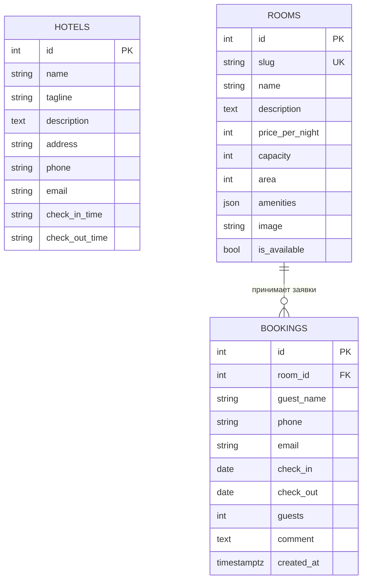

# 05. Модель данных

Три таблицы, ни одной лишней. Определения — в [models.py](../backend/app/models.py), стиль SQLAlchemy 2.0: `Mapped[...]` плюс `mapped_column(...)`, тип колонки выводится из аннотации.

## Схема



Таблица `hotels` ни с чем не связана: гостиница одна, и связь была бы формальностью.

## Решения по типам

**Цена — `int` в рублях, не `Decimal` и не копейки.** Гостиница называет круглые суммы, дробных цен в предметной области нет. Целое число избавляет от вопросов округления в JSON и в шаблонах. Если появятся скидки в процентах, это решение придётся пересматривать.

**Время заезда и выезда — строки `"14:00"`, не `Time`.** Это не момент времени, а надпись на стойке. Строка попадает в вёрстку как есть, без форматирования и без часовых поясов.

**Удобства — JSON-массив строк.** Отдельная таблица `amenities` со связью многие-ко-многим дала бы возможность фильтровать по удобствам и переиспользовать названия. Такой фильтр не требовался, поэтому взят JSON: одна колонка вместо двух таблиц и join. Цена решения — по удобствам нельзя искать через индекс, а опечатка в названии не будет замечена.

**Изображение — путь-строка вида `/images/rooms/lyuks.svg`.** Файлы лежат в [frontend/public/images/rooms/](../frontend/public/images/rooms/) и отдаются Nuxt как статика. База знает только путь, загрузки файлов в проекте нет.

**Slug вместо идентификатора в URL номера.** Адрес `/rooms/lyuks` читается человеком и переживает пересоздание базы, где числовые идентификаторы могут смениться. Колонка уникальна и проиндексирована.

**`created_at` со `server_default=func.now()`.** Момент вставки ставит PostgreSQL, а не Python. У приложения и базы могут разойтись часы, а у базы они одни на всех.

**Комментарий в заявке допускает NULL** — единственное необязательное поле в `bookings`.

## Как создаётся схема

Миграций нет. Таблицы создаёт [seed.py](../backend/seed.py) вызовом `Base.metadata.create_all(engine)` при старте backend.

Из этого следуют два практических правила:

1. Добавили колонку в модель — пересоздайте базу: `docker compose down -v && docker compose up`. `create_all` создаёт только отсутствующие таблицы и **не изменяет существующие**; новая колонка в старой таблице сама не появится.
2. Данные в базе одноразовые. Всё ценное живёт в коде сида, а не в томе.

## Сид

[seed.py](../backend/seed.py) — единственный источник тестовых данных: одна гостиница и шесть номеров (эконом, стандарт, студия, семейный, люкс, апартаменты) с ценами от 2 900 до 12 500 рублей и вместимостью от одного до пяти гостей.

Идемпотентность обеспечена одной проверкой:

```python
if session.scalar(select(func.count(Room.id))):
    print("База уже заполнена, сид пропущен")
    return
```

Счёт идёт по номерам, а не по гостинице: номера — самая содержательная таблица, и её непустота однозначно означает, что сид уже отработал.

Перед созданием таблиц вызывается `wait_for_db` — до тридцати попыток подключения с паузой в секунду. Compose уже дожидается healthcheck, но `pg_isready` может ответить утвердительно за мгновение до конца первичной инициализации кластера.

Запустить сид отдельно:

```bash
docker compose exec backend python seed.py
```

## Вопросы на понимание

1. Вы добавили в `Room` колонку `floor`. Почему `docker compose restart backend` не поможет и что нужно сделать?
2. Почему счётчик идемпотентности считает номера, а не гостиницы?
3. Какой ценой оплачено хранение удобств в JSON?
