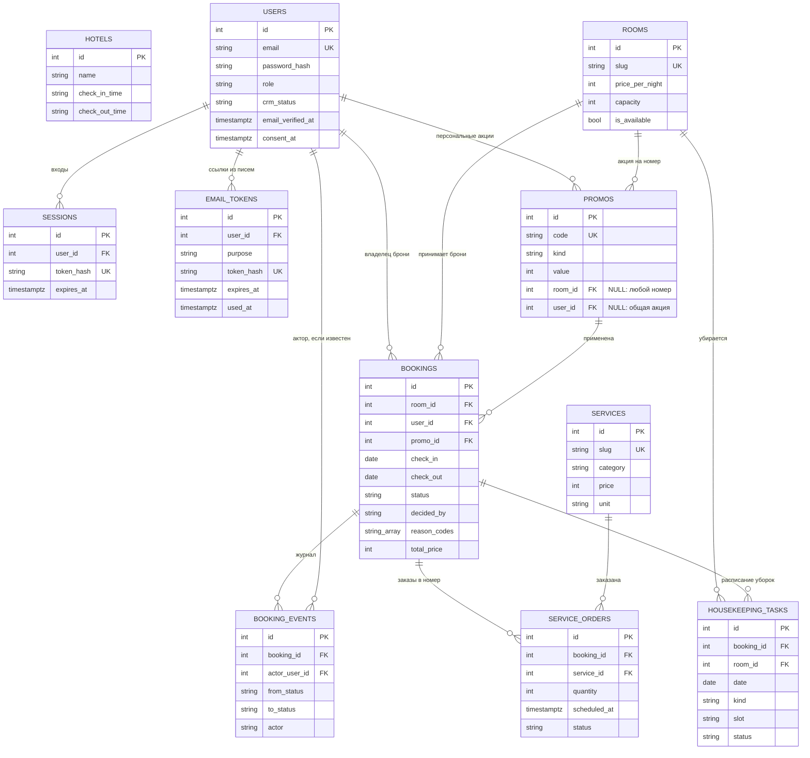

# 05. Модель данных

Одиннадцать таблиц. Модели — в [models.py](../backend/app/models.py), схема базы — в миграциях [0001–0005](../backend/migrations/versions/). Источник истины для схемы — миграции: модели описывают колонки и связи, а ограничения, которые SQLAlchemy-моделью не выражаются (`EXCLUDE`, часть `CHECK`), живут только в миграциях. Как эти таблицы используются в динамике — в [03-runtime-flows.md](03-runtime-flows.md), какие эндпоинты их читают — в [04-backend.md](04-backend.md).

## Схема



На диаграмме только ключевые колонки, полный список — в таблицах ниже. Таблица `hotels` ни с чем не связана: гостиница одна, берётся первая строка (`load_hotel` в [booking_lifecycle.py](../backend/app/booking_lifecycle.py)).

## Таблицы

### `hotels`

Данные гостиницы: `name`, `tagline`, `description`, `address`, `phone`, `email`, `check_in_time`, `check_out_time` (строки `"14:00"`, `"12:00"`). Ограничений нет. Время заезда и выезда нужно расчётам: дедлайн отмены (`guest_cancel_deadline`) и окно заказов услуг (`order_window`).

### `rooms`

| Колонка | Тип | Ограничения | Заметка |
|---|---|---|---|
| `id` | int | PK | |
| `slug` | varchar(60) | уникальный индекс `ix_rooms_slug` | Адрес `/rooms/{slug}` |
| `name`, `description`, `image` | varchar, text | NOT NULL | `image` — путь вида `/images/rooms/lyuks.svg` |
| `price_per_night` | int | NOT NULL | Рубли; брони хранят снимок цены |
| `capacity`, `area` | int | NOT NULL | Вместимость проверяет роутер, а не база |
| `amenities` | JSON | NOT NULL | Массив строк |
| `is_available` | bool | NOT NULL | Снимает номер с продажи; правится в админке |

### `users`

| Колонка | Тип | Ограничения | Заметка |
|---|---|---|---|
| `id` | int | PK | |
| `email` | varchar(254) | уникальный индекс `ix_users_email`, CHECK `users_email_lower_check` (`email = lower(email)`) | Хранится в нижнем регистре: «Ivan@» не встанет рядом с «ivan@» |
| `password_hash` | varchar(200) | NOT NULL | Argon2id |
| `full_name` | varchar(120) | NOT NULL | |
| `phone` | varchar(40) | NULL | Для брони телефон берётся из формы |
| `role` | varchar(20) | CHECK `users_role_check` (`guest`, `admin`), по умолчанию `guest` | |
| `crm_status` | varchar(20) | CHECK `users_crm_status_check` (`regular`, `vip`, `blocked`), по умолчанию `regular` | По нему `decide()` решает судьбу новых броней |
| `crm_note` | text | NULL | Заметка администратора, гость её не видит |
| `is_active` | bool | NOT NULL, по умолчанию true | Пользователей не удаляют, а деактивируют |
| `email_verified_at` | timestamptz | NULL | `NULL` — бронировать нельзя |
| `consent_at` | timestamptz | NOT NULL | Согласие на обработку данных при регистрации |
| `created_at`, `last_login_at` | timestamptz | `created_at` ставит база | |

### `sessions`

`id`, `user_id` (FK → `users`, `ON DELETE CASCADE`, индекс), `token_hash` varchar(64) (**уникальный индекс**, sha256 токена из cookie `kivana_session`), `created_at`, `expires_at`. Сам токен в базе не хранится. Срок жизни задаёт роль: 14 дней гостю (`SESSION_TTL_GUEST_DAYS`), 12 часов администратору (`SESSION_TTL_ADMIN_HOURS`). Истёкшие строки пользователя удаляются при его следующем входе: планировщика нет.

### `email_tokens`

`id`, `user_id` (FK → `users`, `CASCADE`, индекс), `purpose` (CHECK `email_tokens_purpose_check`: `verify_email`, `reset_password`), `token_hash` (уникальный индекс, sha256), `created_at`, `expires_at`, `used_at`. Живёт 24 часа для подтверждения почты и 1 час для сброса пароля. Токен одноразовый: `used_at` не `NULL` — ссылка использована или заменена более новой.

### `promos`

| Колонка | Тип | Ограничения | Заметка |
|---|---|---|---|
| `code` | varchar(32) | UNIQUE | Хранится в верхнем регистре (`normalize_code`) |
| `title`, `description` | varchar(120), text | NOT NULL | |
| `kind` | varchar(10) | CHECK `promos_kind_check` (`percent`, `fixed`) | |
| `value` | int | CHECK `promos_value_check` (`value >= 1`) | Проценты или рубли в зависимости от `kind` |
| `valid_from`, `valid_to` | date | CHECK `promos_dates_check` (`valid_to >= valid_from`) | Границы включительно |
| `min_nights` | int | CHECK `promos_min_nights_check` (`>= 1`), по умолчанию 1 | |
| `room_id` | int | FK → `rooms`, индекс, NULL | `NULL` — акция на любой номер |
| `user_id` | int | FK → `users`, индекс, NULL | `NULL` — общая акция, иначе персональная |
| `is_active` | bool | по умолчанию true | |

### `bookings`

| Колонка | Тип | Ограничения | Заметка |
|---|---|---|---|
| `id` | int | PK | |
| `room_id` | int | FK → `rooms`, индекс `ix_bookings_room_id` | |
| `user_id` | int | FK → `users`, NOT NULL, индекс `ix_bookings_user_id` | Владелец. Email брони — из аккаунта |
| `guest_name`, `phone` | varchar | NOT NULL | Снимок на момент брони |
| `check_in`, `check_out` | date | CHECK `bookings_dates_check` (`check_out > check_in`) | |
| `guests` | int | CHECK `bookings_guests_check` (`guests >= 1`) | Верхнюю границу даёт вместимость номера в роутере |
| `comment` | text | NULL | Комментарий отправляет заявку на ручной разбор |
| `status` | varchar(20) | CHECK `bookings_status_check` (`pending`, `confirmed`, `declined`, `cancelled`), по умолчанию `pending` | Меняет только `change_status` |
| `decided_by` | varchar(20) | CHECK `bookings_decided_by_check` (`system`, `admin`), NULL | Кто подтвердил или отклонил |
| `reason_codes` | varchar(32)[] | NOT NULL, по умолчанию `{}` | Коды причин последнего решения (ключи `REASON_TEXTS`) |
| `reason_text` | text | NULL | Текст администратора |
| `nights`, `price_per_night`, `discount`, `total_price` | int | CHECK `bookings_price_check` (`nights >= 1`, остальные `>= 0`) | Снимок цены на момент брони |
| `promo_id` | int | FK → `promos` `ON DELETE RESTRICT`, индекс `ix_bookings_promo_id`, NULL | Применённая акция |
| `cancelled_by` | varchar(20) | CHECK `bookings_cancelled_by_check` (`guest`, `admin`), NULL | |
| `cancelled_at` | timestamptz | NULL | |
| `created_at` | timestamptz | `server_default now()` | |
| — | — | **EXCLUDE `bookings_no_overlap`** | см. ниже |

### `booking_events`

Журнал переходов: запись добавляется при каждом переходе и больше не меняется.

| Колонка | Тип | Ограничения | Заметка |
|---|---|---|---|
| `booking_id` | int | FK → `bookings` `ON DELETE CASCADE`, индекс | |
| `from_status` | varchar(20) | NULL | `NULL` — событие создания заявки |
| `to_status` | varchar(20) | NOT NULL | |
| `actor` | varchar(20) | CHECK `booking_events_actor_check` (`system`, `admin`, `guest`) | |
| `actor_user_id` | int | FK → `users` `ON DELETE SET NULL`, NULL | У `system` пуст |
| `reason_codes`, `reason_text` | varchar(32)[], text | как в `bookings` | Причины именно этого перехода |
| `created_at` | timestamptz | `server_default now()` | |

События одной транзакции получают одинаковое `now()`, поэтому связь `Booking.events` упорядочена по `id`, а не по времени.

### `services`

| Колонка | Тип | Ограничения | Заметка |
|---|---|---|---|
| `slug` | varchar(60) | UNIQUE | |
| `title`, `description` | varchar(120), text | NOT NULL | |
| `category` | varchar(20) | CHECK `services_category_check` (`food`, `housekeeping`, `transfer`, `wellness`, `other`) | `food` подчиняется окну `ROOM_SERVICE_HOURS` |
| `price` | int | CHECK `services_price_check` (`>= 0`) | Рубли |
| `unit` | varchar(10) | CHECK `services_unit_check` (`per_item`, `per_stay`) | За штуку или за всё проживание |
| `is_active` | bool | по умолчанию true | Неактивная скрыта из каталога, но остаётся в заказах |
| `sort_order` | int | по умолчанию 100 | Порядок показа |

### `service_orders`

| Колонка | Тип | Ограничения | Заметка |
|---|---|---|---|
| `booking_id` | int | FK → `bookings` `CASCADE`, индекс | |
| `service_id` | int | FK → `services` `ON DELETE RESTRICT`, индекс | Услугу с заказами не удалить |
| `quantity` | int | CHECK `service_orders_quantity_check` (`BETWEEN 1 AND 20`) | |
| `unit_price`, `total` | int | NOT NULL | Снимок цены на момент заказа |
| `scheduled_at` | timestamptz | NOT NULL, индекс | На когда заказ; по нему выбирают день в админке |
| `comment` | text | NULL | |
| `status` | varchar(10) | CHECK `service_orders_status_check` (`new`, `accepted`, `done`, `cancelled`), по умолчанию `new` | Меняет только `change_order_status` |
| `created_at` | timestamptz | `server_default now()` | |

### `housekeeping_tasks`

| Колонка | Тип | Ограничения | Заметка |
|---|---|---|---|
| `booking_id` | int | FK → `bookings` `CASCADE` | |
| `room_id` | int | FK → `rooms`, индекс | |
| `date` | date | NOT NULL, индекс `ix_housekeeping_tasks_date` | Админ открывает расписание за день |
| `kind` | varchar(10) | CHECK `housekeeping_tasks_kind_check` (`daily`, `checkout`) | |
| `slot` | varchar(10) | CHECK `housekeeping_tasks_slot_check` (`morning`, `day`, `evening`, `dnd`), по умолчанию `morning` | |
| `status` | varchar(10) | CHECK `housekeeping_tasks_status_check` (`planned`, `done`, `skipped`), по умолчанию `planned` | |
| `done_at` | timestamptz | NULL | Ставится при `done` |
| — | — | UNIQUE `housekeeping_tasks_unique` (`booking_id`, `date`, `kind`) | Не даёт создать дубль уборки |

## Связи и каскады

| Что удаляют | Что происходит | Зачем так |
|---|---|---|
| Бронь | `booking_events`, `service_orders`, `housekeeping_tasks` удаляются каскадом | Они осмысленны только вместе с бронью. Через API брони не удаляются: отмена меняет статус, история остаётся |
| Пользователь | `sessions` и `email_tokens` каскадом; брони и акции пользователя не дают его удалить (FK без каскада); `booking_events.actor_user_id` обнуляется | Пользователей деактивируют (`is_active`), а не удаляют |
| Акцию | `RESTRICT`, пока на неё ссылается бронь; API отвечает 409 «только деактивировать» | Бронь хранит снимок скидки, но ссылка на акцию нужна для занятости кода |
| Услугу | `RESTRICT`, пока есть заказы; API отвечает 409 | История заказов не теряется |
| Номер | FK без каскада у броней, акций, уборок | Удаления номеров в API нет: номер снимают с продажи (`is_available`) |

## Ограничение `bookings_no_overlap`

Создано в [0001_initial.py](../backend/migrations/versions/0001_initial.py):

```sql
ALTER TABLE bookings ADD CONSTRAINT bookings_no_overlap
EXCLUDE USING gist (room_id WITH =, daterange(check_in, check_out) WITH &&)
WHERE (status = 'confirmed')
```

EXCLUDE-ограничение запрещает две строки, для которых все перечисленные сравнения истинны. Здесь это «тот же номер» и «диапазоны дат пересекаются». Условие `WHERE` сужает проверку до подтверждённых броней: заявки `pending`, а также `declined` и `cancelled` могут пересекаться сколько угодно. Предикат из версии 1.0 остаётся верным и после миграции 0003: даты блокирует только `confirmed`.

`daterange(check_in, check_out)` по умолчанию полуоткрытый: `[check_in, check_out)`. День выезда в диапазон не входит, поэтому выезд одного гостя и заезд другого в тот же день не конфликтуют. Тот же интервал использует `overlapping()` в [booking_lifecycle.py](../backend/app/booking_lifecycle.py).

Сравнивать целое число оператором `=` в gist-индексе PostgreSQL умеет только с расширением `btree_gist`. Миграция включает его первой строкой; расширение входит в стандартную поставку, в том числе в образ `postgres:16-alpine`.

**Почему ограничение, а не проверка в коде.** Проверка «нет ли подтверждённой брони на эти даты» с последующим `UPDATE` — гонка: два одновременных подтверждения обе пройдут проверку и обе запишутся. Ограничение проверяет сама база в момент записи, и вторая транзакция получает `IntegrityError`; `change_status` превращает его в 409 «Эти даты только что заняли» и откатывает запрос. Проверка `dates_taken` при создании заявки всё равно есть, но ради понятного сообщения гостю, а не ради гарантии.

## Решения по типам и схеме

**Цена — `int` в рублях.** Дробных цен в предметной области нет, целое число избавляет от вопросов округления.

**Время заезда и выезда — строки `"14:00"`.** Это надпись на стойке, а не момент времени; момент строится по часам отеля через `hotel_time.hotel_datetime`. Все моменты — `timestamptz`, даты заезда и выезда — `date`.

**Статусы — строки с CHECK, а не ENUM PostgreSQL.** Добавить значение в PG ENUM можно, а удалить или переименовать — только пересоздав тип. Строка с CHECK меняется одной миграцией; именно так миграция 0003 заменила `new` на `pending`/`declined`. В Python значения перечислены в `StrEnum` ([models.py](../backend/app/models.py)). У `booking_events.from_status` и `to_status` CHECK нет: журнал не должен падать, если статусы изменятся.

**Снимки вместо ссылок.** В брони — имя, телефон, цена за ночь, число ночей, скидка и итог; в заказе — цена и сумма. Изменение прайса, профиля или каталога не переписывает историю.

**Вычисляемое не хранится.** Сегмент клиента (`new`, `guest`, `regular`), показатели CRM (проживания, ночи, выручка, последний визит), «Проживание» и «Завершена», занятость промокода, дедлайн отмены считаются запросом или кодом ([crm.py](../backend/app/crm.py), [booking_rules.py](../backend/app/booking_rules.py), [promos.py](../backend/app/promos.py)). Нечему рассинхронизироваться, а данных мало.

**Промокод одноразовый без отдельного счётчика.** Код занят, пока есть бронь с этим `promo_id` в статусе `pending` или `confirmed` (`HOLDING_STATUSES`). Отказ и отмена освобождают код сами. Гарантия — не ограничение базы, а блокировка строки акции `SELECT ... FOR UPDATE` в `find_promo(lock=True)` при создании брони: вторая параллельная бронь ждёт первую и видит код занятым.

**Массив причин — `varchar(32)[]`.** Коды причин решения (`auto_ok`, `long_stay` и др.) — короткие ключи; перечень на бронь невелик, отдельная таблица была бы лишней. Тексты по-русски хранятся в коде (`REASON_TEXTS`), а не в базе.

**Удобства номера — JSON-массив строк.** Одна колонка вместо двух таблиц и join; по удобствам нельзя искать через индекс, но поиска по ним нет.

**Изображение — путь вида `/images/rooms/lyuks.svg`.** Файлы лежат в [frontend/public/images/rooms/](../frontend/public/images/rooms/). Загрузки файлов в проекте нет.

**Slug в URL номера.** Адрес `/rooms/lyuks` читается человеком и не зависит от числовых идентификаторов.

**`created_at` ставит PostgreSQL** через `server_default=func.now()`: у базы одни часы на всех.

**Расхождение модели и миграции.** В [models.py](../backend/app/models.py) у `HousekeepingTask.booking_id` объявлен `index=True`, а миграция 0005 индекса по этой колонке не создаёт (только по `room_id` и `date`). На практике выборки по брони обслуживает ведущая колонка уникального ограничения `housekeeping_tasks_unique`, но autogenerate предложит добавить индекс. См. [09-tech-debt.md](09-tech-debt.md).

## Миграции

Версии применяются по цепочке `0001 → 0002 → 0003 → 0004 → 0005` командой `alembic upgrade head` при каждом старте backend. Конфигурация — [alembic.ini](../backend/alembic.ini) и [env.py](../backend/migrations/env.py), URL берётся из `DATABASE_URL`.

| Версия | Файл | Что меняет |
|---|---|---|
| 0001 | [0001_initial.py](../backend/migrations/versions/0001_initial.py) | Расширение `btree_gist`; таблицы `hotels`, `rooms`, `bookings` (статусы `new`, `confirmed`, `cancelled`, поле `email`); `bookings_no_overlap` |
| 0002 | [0002_accounts.py](../backend/migrations/versions/0002_accounts.py) | Аккаунты: `users` (роль, подтверждение почты, согласие), `sessions`, `email_tokens`; уникальные индексы по email и хэшам токенов |
| 0003 | [0003_booking_lifecycle.py](../backend/migrations/versions/0003_booking_lifecycle.py) | Жизненный цикл: статусы `pending`/`confirmed`/`declined`/`cancelled`, `bookings.user_id` вместо `email`, поля решения, цены и отмены, таблица `booking_events`, `users.crm_status` |
| 0004 | [0004_crm_promos.py](../backend/migrations/versions/0004_crm_promos.py) | `users.crm_note`, таблица `promos`, `bookings.promo_id` |
| 0005 | [0005_services_housekeeping.py](../backend/migrations/versions/0005_services_housekeeping.py) | Таблицы `services`, `service_orders`, `housekeeping_tasks` |

**Нетривиальное.**

- **0003 удаляет все брони** (`DELETE FROM bookings`): брони версии 1.0 создавались без аккаунта и были демо-данными, привязать их к пользователю нельзя, а без этого не встанет `NOT NULL` на `user_id`. `downgrade` тоже удаляет брони, потому что в старой схеме у брони обязателен email и нет статусов `pending` и `declined`. Перед обновлением боевой базы с версии 1.0 это нужно знать.
- В 0003 `CHECK` на статус пересоздаётся: старый удаляется, новый создаётся. Предикат `bookings_no_overlap` не меняется.
- `ARRAY(String(32))` с `server_default="{}"` — PostgreSQL-специфичный тип, поэтому проект привязан к PostgreSQL.
- Том, созданный версией 1.0 через `create_all` без таблицы `alembic_version`, миграции не примут («relation already exists»): том пересоздаётся один раз, см. [07-infrastructure.md](07-infrastructure.md).

**Как меняется схема.**

1. Поменяйте модель в [models.py](../backend/app/models.py).
2. Создайте миграцию: `docker compose exec backend alembic revision --autogenerate -m "что изменилось"`.
3. Прочитайте сгенерированный файл в `backend/migrations/versions/`. Autogenerate не отслеживает `CHECK`- и `EXCLUDE`-ограничения, их изменения дописываются вручную через `op.execute` или `op.create_check_constraint`. Если миграция удаляет данные, напишите это в docstring, как в 0003.
4. Перезапустите backend: `alembic upgrade head` выполнится при старте.

Тесты ([conftest.py](../backend/conftest.py)) создают отдельную базу `kivana_test` и накатывают все миграции на пустую базу при каждом прогоне, поэтому сломанная миграция уронит их первой.

## Сид

[seed.py](../backend/seed.py) запускается после миграций и схему не создаёт. Каждый блок принимает `Session` и не коммитит; коммитит `main()`. Порядок: справочники → администратор → демо-данные.

| Блок | Что делает | Идемпотентность |
|---|---|---|
| `seed_hotel` | Одна гостиница: заезд 14:00, выезд 12:00 | Пропускается, если в `hotels` есть строка |
| `seed_rooms` | 6 номеров: `econom` 2 900 ₽ (1 гость), `standart` 4 500 (2), `studiya` 5 600 (2), `semeyny` 6 800 (4), `lyuks` 9 900 (2), `apartamenty` 12 500 (5) | Добавляет только недостающие `slug`, существующие не трогает |
| `seed_services` | 14 услуг: 7 блюд и завтраков, 3 уборки, трансфер, массаж, 2 прочих; порядок строк — `sort_order` | Добавляет только недостающие `slug` |
| `create_admin` | Администратор из `ADMIN_EMAIL` и `ADMIN_PASSWORD` с подтверждённой почтой. Пароль проверяется политикой паролей: при отказе `SystemExit`, и uvicorn не стартует | Пропускается, если пользователь с этим email есть; пароль существующего не меняется |
| `seed_demo` (при `SEED_DEMO=true`) | Четыре демо-клиента `@demo.kivana.ru` с паролем `DEMO_PASSWORD`: `anna` (regular), `viktor` (VIP), `igor` (blocked), `maria` (regular); четыре акции `ANNA-10`, `MARIA-500`, `VIKTOR-LUX`, `KIVANA-10`; 8 броней во всех статусах, три заказа услуг и уборки | Пропускается целиком, если демо-клиенты уже есть |

Демо-брони создаются теми же функциями, что и из API (`submit_booking`, `change_status`, `create_order`), поэтому журнал событий, уборки и статусы согласованы. Все даты считаются от сегодняшнего дня гостиницы: два завершённых проживания, текущее с заказами, два будущих подтверждённых (у Анны — с персональной акцией, у Виктора на 9 ночей — подтверждено автоматически как у VIP), одна заявка на рассмотрении (длинное проживание и комментарий), одна отклонённая (заблокированный клиент) и одна отменённая гостем. Если правила решат иначе, чем задумано для демо, сид падает с `RuntimeError`, а не пишет неверные данные. Письма при сиде не отправляются.

На боевом сервере ставят `SEED_DEMO=false`: останутся только справочники и администратор. Правка `seed.py` на заполненной базе не изменит существующие цены и описания: их правят через админку или миграцией. Тесты запускают сид с `SEED_DEMO=false`.

## Вопросы на понимание

1. Вы подтверждаете заявку на 10–13 число, а уже подтверждена бронь на 13–15. Пропустит ли база, и почему? (Да: диапазоны полуоткрытые, `[10, 13)` и `[13, 15)` не пересекаются; выезд и заезд в один день не конфликтуют.)
2. Почему статус хранится строкой с CHECK, а не типом ENUM? (Строку с CHECK меняет одна миграция; значение PG ENUM удалить или переименовать нельзя без пересоздания типа. Так 0003 заменила `new` на `pending` и добавила `declined`.)
3. Как база гарантирует, что промокод применён только в одной активной брони? (Не ограничением: код считается занятым, пока есть бронь в `pending` или `confirmed`, а параллельные брони упорядочивает `FOR UPDATE` на строке акции.)
4. Вы поменяли цену люкса в `seed.py` и перезапустили backend. Изменится ли цена на сайте? (Нет: `seed_rooms` не трогает существующие `slug`; цену правят в админке или миграцией.)
